# Module 4: Caching

> "The fastest database query is the one you never make."

Caching is the single most effective technique for improving system performance. This module covers caching strategies, eviction policies, and the hardest problem in computer science: cache invalidation.

---

## 1. Why Caching Matters

### The Performance Gap

```
Database query:     5-50ms
Cache lookup:       0.1-1ms
Improvement:        50-500x faster
```

### Real Impact

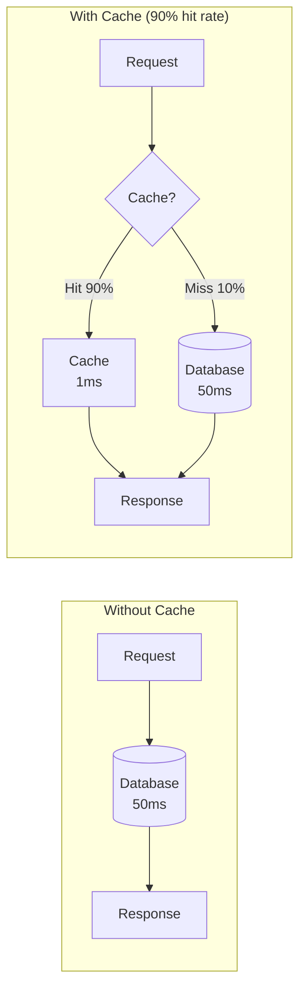

**Average latency calculation:**
```
Without cache: 50ms

With 90% cache hit rate:
= (0.9 × 1ms) + (0.1 × 50ms)
= 0.9ms + 5ms
= 5.9ms

Improvement: 8.5x faster
```

### Cache Hit Rate Impact

| Hit Rate | Avg Latency (1ms cache, 50ms DB) | Speedup |
|----------|----------------------------------|---------|
| 0% | 50ms | 1x |
| 50% | 25.5ms | 2x |
| 80% | 10.8ms | 4.6x |
| 90% | 5.9ms | 8.5x |
| 95% | 3.45ms | 14.5x |
| 99% | 1.49ms | 33.6x |

**Key insight**: Going from 90% to 99% hit rate improves performance 4x. The last few percentage points matter enormously.

---

## 2. Cache Placement

### The Caching Layers

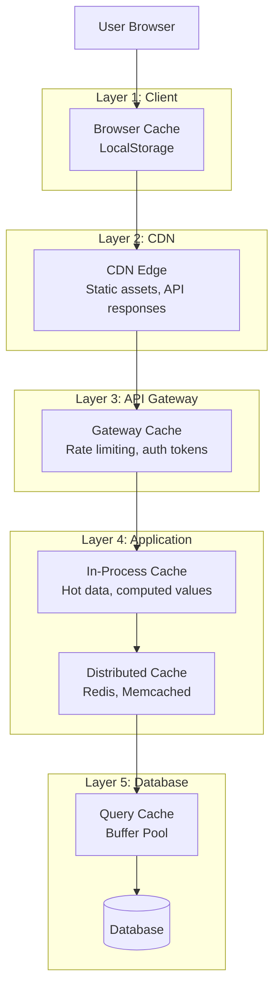

### Layer Comparison

| Layer | Latency | Capacity | Shared | Best For |
|-------|---------|----------|--------|----------|
| Browser | 0ms | ~50MB | No | Static assets, user prefs |
| CDN | 10-50ms | Huge | Yes | Images, JS, CSS, public API |
| In-Process | 0.001ms | ~1GB | No | Hot data, computed values |
| Distributed | 0.5-2ms | ~100GB+ | Yes | Sessions, shared state |
| DB Buffer | 0.1ms | ~64GB | Yes | Recent queries |

### When to Cache Where

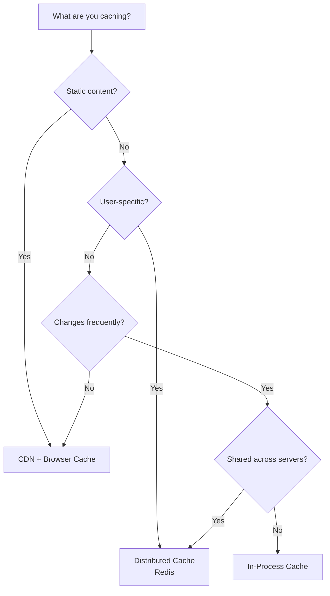

---

## 3. Caching Strategies

### Strategy 1: Cache-Aside (Lazy Loading)

**Application manages cache explicitly.**

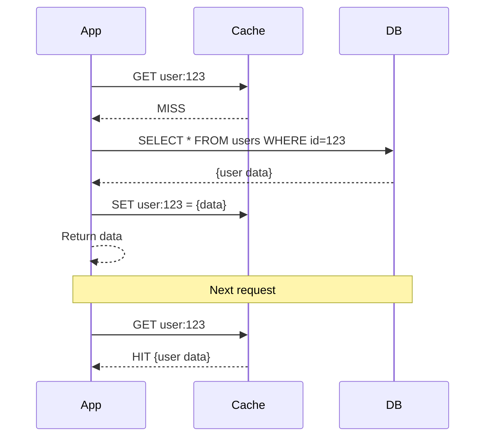

```go
func getUser(userID string) (*User, error) {
    // Try cache first
    cached, err := cache.Get(ctx, "user:"+userID)
    if err == nil && cached != "" {
        return deserializeUser(cached), nil
    }
    
    // Cache miss - load from DB
    user, err := db.QueryUser(userID)
    if err != nil {
        return nil, err
    }
    
    // Populate cache
    cache.Set(ctx, "user:"+userID, serializeUser(user), time.Hour)
    
    return user, nil
}
```

**Pros:**
- Only requested data is cached
- Cache failures don't break the system
- Simple to implement

**Cons:**
- Cache miss = slower (extra round trip)
- Data can become stale
- Cache stampede on cold start

**Use when:** Read-heavy workloads, can tolerate stale data

---

### Strategy 2: Read-Through

**Cache sits in front of DB, loads data automatically on miss.**

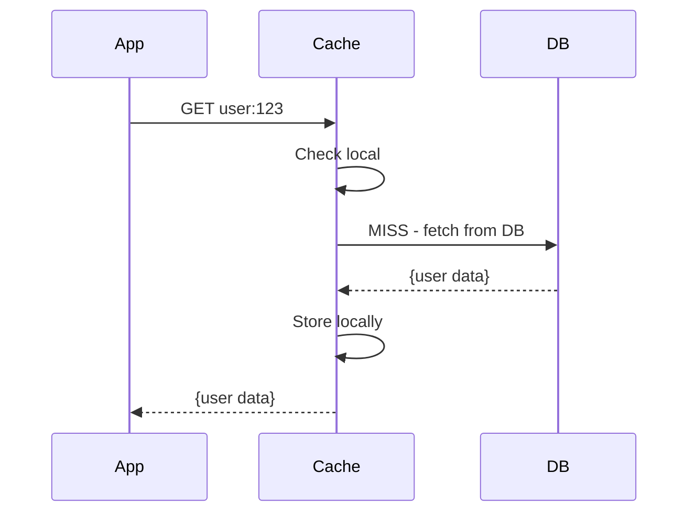

**Difference from cache-aside:** Cache handles DB loading, not application.

**Pros:**
- Simpler application code
- Consistent loading logic

**Cons:**
- Cache library must support DB integration
- Less control over loading behavior

**Use when:** Using a caching library with read-through support (e.g., Hibernate L2 cache)

---

### Strategy 3: Write-Through

**Writes go through cache to database synchronously.**

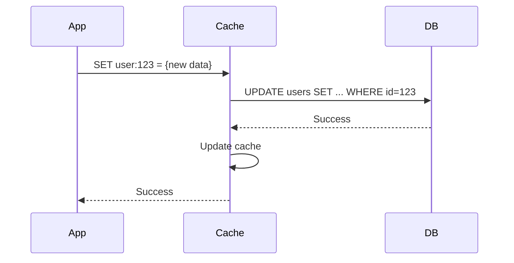

```go
func updateUser(userID string, data *UserData) error {
    // Write to cache, which writes to DB
    cache.Set(ctx, "user:"+userID, data) // Cache handles DB write
    // OR manually:
    if err := db.Update("UPDATE users SET ... WHERE id = ?", data, userID); err != nil {
        return err
    }
    cache.Set(ctx, "user:"+userID, data, time.Hour)
    return nil
}
```

**Pros:**
- Cache always consistent with DB
- No stale data on reads

**Cons:**
- Higher write latency (must wait for DB)
- Write amplification if data rarely read

**Use when:** Strong consistency required, read-after-write needed

---

### Strategy 4: Write-Behind (Write-Back)

**Writes to cache immediately, async flush to database.**

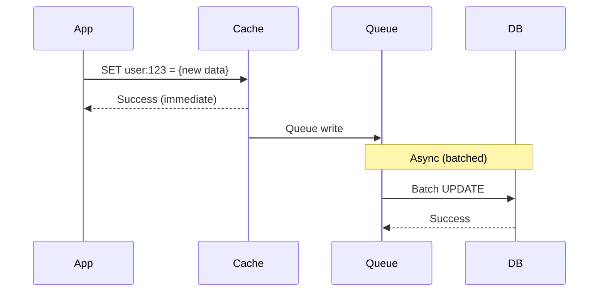

```go
func updateUser(userID string, data *UserData) error {
    // Write to cache immediately
    cache.Set(ctx, "user:"+userID, data, time.Hour)
    
    // Queue async DB write
    writeQueue.Push(WriteJob{
        Table: "users",
        ID:    userID,
        Data:  data,
    })
    
    return nil // Return before DB write completes
}

// Background worker
func flushWrites() {
    batch := writeQueue.GetBatch(100)
    db.BulkUpdate(batch)
}
```

**Pros:**
- Very fast writes (async)
- Can batch DB writes (efficiency)
- Handles write spikes

**Cons:**
- Data loss risk if cache fails before flush
- Complexity in failure handling
- Eventual consistency

**Use when:** Write-heavy, can tolerate some data loss, need to absorb write spikes

---

### Strategy 5: Write-Around

**Writes go directly to database, bypassing cache.**

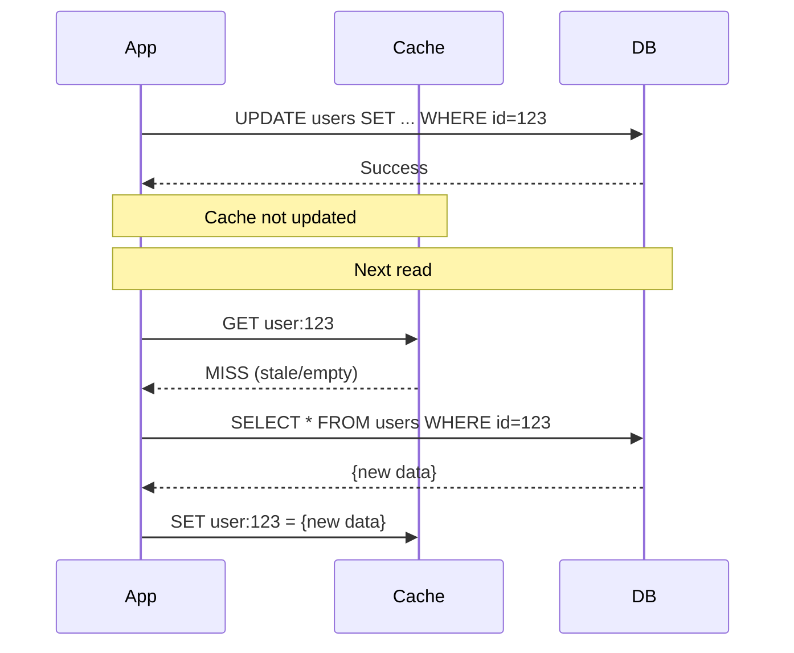

**Pros:**
- Prevents cache pollution from write-heavy data
- Good for write-once-read-never data

**Cons:**
- First read after write is slow
- Stale data if cache not invalidated

**Use when:** Data written frequently but rarely read

---

### Strategy Comparison

| Strategy | Write Latency | Read Latency | Consistency | Data Loss Risk |
|----------|---------------|--------------|-------------|----------------|
| Cache-Aside | N/A (direct to DB) | Miss: High | Eventual | None |
| Read-Through | N/A | Miss: High | Eventual | None |
| Write-Through | High (sync) | Low | Strong | None |
| Write-Behind | Low (async) | Low | Eventual | Yes |
| Write-Around | Low (direct) | Miss: High | Eventual | None |

---

## 4. Eviction Policies

When cache is full, what gets removed?

### LRU (Least Recently Used)

**Evict the item that hasn't been accessed longest.**

```
Access sequence: A, B, C, D, A, E (cache size: 4)

[A]           → A accessed
[A, B]        → B accessed
[A, B, C]     → C accessed
[A, B, C, D]  → D accessed (cache full)
[B, C, D, A]  → A accessed (moved to end)
[C, D, A, E]  → E accessed, B evicted (least recent)
```

**Implementation:** Doubly-linked list + hash map (O(1) operations)

**Pros:** Good for temporal locality (recent = likely accessed again)
**Cons:** Doesn't consider frequency; one-time scans pollute cache

**Use when:** General purpose, most common choice

---

### LFU (Least Frequently Used)

**Evict the item with fewest accesses.**

```
State: A(5), B(2), C(8), D(1)  ← access counts
Cache full, new item E arrives
Evict D (lowest frequency: 1)
Result: A(5), B(2), C(8), E(1)
```

**Pros:** Keeps popular items in cache
**Cons:** Slow to adapt (old popular items stick around)

**Use when:** Strong frequency patterns, popularity-based access

---

### FIFO (First In First Out)

**Evict oldest item regardless of access pattern.**

```
Insert sequence: A, B, C, D, E (cache size: 4)

[A, B, C, D]  → Full
[B, C, D, E]  → E inserted, A evicted (oldest)
```

**Pros:** Simple, O(1), predictable
**Cons:** Ignores access patterns completely

**Use when:** Simplicity matters more than hit rate

---

### TTL (Time To Live)

**Items expire after fixed duration.**

```go
cache.Set(ctx, "user:123", data, time.Hour) // Expires in 1 hour

// Or with absolute expiration
expiresAt := time.Date(2024, 1, 2, 0, 0, 0, 0, time.UTC)
cache.Set(ctx, "daily_report", data, time.Until(expiresAt))
```

**Pros:** Guarantees freshness, automatic cleanup
**Cons:** May evict still-useful data; thundering herd at expiration

**Use when:** Data has known freshness requirements

---

### Eviction Policy Comparison

| Policy | Hit Rate | Complexity | Memory Overhead | Best For |
|--------|----------|------------|-----------------|----------|
| LRU | High | Medium | Medium (pointers) | General purpose |
| LFU | Higher for popular data | High | High (counters) | Popularity-based |
| FIFO | Low | Low | Low | Simple cases |
| TTL | Variable | Low | Low | Time-sensitive data |
| Random | Medium | Very Low | None | When access pattern unknown |

---

## 5. Cache Invalidation

> "There are only two hard things in Computer Science: cache invalidation and naming things." — Phil Karlton

### The Problem

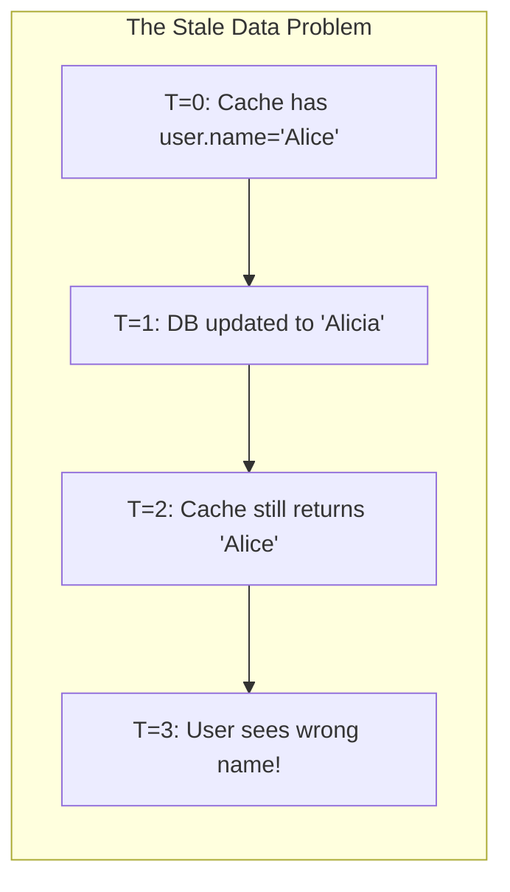

### Strategy 1: TTL-Based Expiration

**Set expiration time on cache entries.**

```go
// Short TTL for frequently changing data
cache.Set(ctx, "stock_price:AAPL", price, time.Minute) // 1 minute

// Long TTL for stable data
cache.Set(ctx, "product:123", product, 24*time.Hour) // 24 hours
```

**Trade-off:**
- Short TTL: More DB load, fresher data
- Long TTL: Less DB load, staler data

**TTL Guidelines:**

| Data Type | Suggested TTL | Reason |
|-----------|---------------|--------|
| User session | 30 min - 24 hours | Security + UX |
| Product catalog | 1-24 hours | Changes infrequently |
| Stock prices | 1-60 seconds | Real-time needed |
| User profile | 5-60 minutes | Balance freshness/load |
| Static config | 1-24 hours | Rarely changes |
| Search results | 5-15 minutes | Freshness matters |

---

### Strategy 2: Event-Based Invalidation

**Invalidate when data changes.**

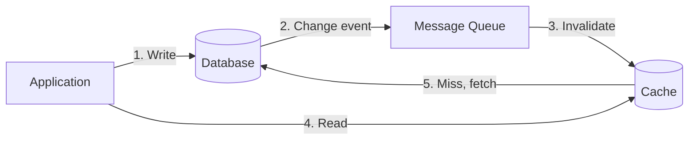

```go
func updateUser(userID string, data *UserData) error {
    // Update database
    if err := db.Update("UPDATE users SET ... WHERE id = ?", data, userID); err != nil {
        return err
    }
    
    // Invalidate cache
    cache.Delete(ctx, "user:"+userID)
    
    // Or publish event for other services
    events.Publish("user_updated", map[string]string{"user_id": userID})
    return nil
}

// Subscriber
func handleUserUpdate(event Event) {
    userID := event.Data["user_id"]
    cache.Delete(ctx, "user:"+userID)
    cache.Delete(ctx, "user_profile:"+userID)
    cache.Delete(ctx, "user_feed:"+userID)
}
```

**Pros:** Immediate invalidation, no stale data
**Cons:** Complexity, must track all related cache keys

---

### Strategy 3: Version-Based Invalidation

**Include version in cache key.**

```go
// Store current version
cache.Set(ctx, "user:123:version", "42", 0)

// Cache with version
cache.Set(ctx, "user:123:v42", userData, time.Hour)

func getUser(userID string) *User {
    version, _ := cache.Get(ctx, "user:"+userID+":version")
    data, _ := cache.Get(ctx, fmt.Sprintf("user:%s:v%s", userID, version))
    return deserializeUser(data)
}

func updateUser(userID string, data *UserData) {
    db.Update(userID, data)
    // Increment version - old cache entries become orphaned
    cache.Incr(ctx, "user:"+userID+":version")
}
```

**Pros:** Old data automatically invalid, no explicit deletion
**Cons:** Cache fills with old versions (need TTL cleanup)

---

### Strategy 4: Cache-Aside with Write Invalidation

**Delete on write, populate on read.**

```go
func updateUser(userID string, data *UserData) error {
    // Write to DB
    if err := db.Update("UPDATE users SET ... WHERE id = ?", data, userID); err != nil {
        return err
    }
    
    // Delete from cache (don't update!)
    cache.Delete(ctx, "user:"+userID)
    
    // Next read will populate cache with fresh data
    return nil
}

func getUser(userID string) (*User, error) {
    cached, err := cache.Get(ctx, "user:"+userID)
    if err == nil && cached != "" {
        return deserializeUser(cached), nil
    }
    
    user, err := db.GetUser(userID)
    if err != nil {
        return nil, err
    }
    cache.Set(ctx, "user:"+userID, serializeUser(user), time.Hour)
    return user, nil
}
```

**Why delete instead of update?**
- Avoids race conditions between concurrent writes
- Simpler (no need to construct cache value on write path)
- Cache populated with data actually being read

---

### Invalidation Patterns Comparison

| Pattern | Consistency | Complexity | DB Load | Best For |
|---------|-------------|------------|---------|----------|
| TTL only | Eventual (bounded) | Low | Medium | Simple cases |
| Event-based | Strong | High | Low | Critical data |
| Version-based | Strong | Medium | Low | High-write scenarios |
| Write invalidation | Strong | Low | Medium | General purpose |

---

## 6. Common Caching Problems

### Problem 1: Cache Stampede (Thundering Herd)

**What happens:** Popular cache entry expires, hundreds of requests simultaneously hit database.

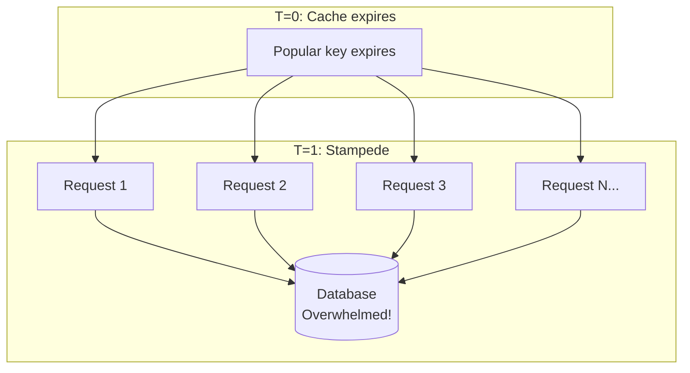

**Solutions:**

**1. Locking (Mutex)**
```go
func getWithLock(key string) (string, error) {
    value, err := cache.Get(ctx, key)
    if err == nil && value != "" {
        return value, nil
    }
    
    // Try to acquire lock
    lockKey := "lock:" + key
    acquired, _ := cache.SetNX(ctx, lockKey, "1", 10*time.Second)
    if acquired {
        defer cache.Delete(ctx, lockKey)
        
        value, err := db.Fetch(key)
        if err != nil {
            return "", err
        }
        cache.Set(ctx, key, value, time.Hour)
        return value, nil
    }
    
    // Someone else is loading, wait and retry
    time.Sleep(100 * time.Millisecond)
    return getWithLock(key)
}
```

**2. Early Expiration (Probabilistic)**
```go
func getWithEarlyRefresh(key string, ttl time.Duration, beta float64) (string, error) {
    value, expiry, _ := cache.GetWithExpiry(ctx, key)
    
    // Probabilistically refresh before expiry
    timeUntilExpiry := time.Until(expiry).Seconds()
    if value != "" && rand.Float64() < beta*math.Exp(-timeUntilExpiry) {
        // Refresh in background
        go backgroundRefresh(key)
    }
    
    if value != "" {
        return value, nil
    }
    return fetchAndCache(key)
}
```

**3. Stale-While-Revalidate**
```go
func getWithStale(key string) (string, error) {
    value, isStale, _ := cache.GetWithStaleFlag(ctx, key)
    
    if value != "" && isStale {
        // Return stale value, refresh async
        go backgroundRefresh(key)
        return value, nil
    } else if value != "" {
        return value, nil
    }
    return fetchAndCache(key)
}
```

---

### Problem 2: Hot Key

**What happens:** Single key receives extreme traffic, overwhelming one cache node.

```
Normal key:   100 requests/sec
Hot key:      1,000,000 requests/sec (celebrity tweet, viral product)
```

**Solutions:**

**1. Local Cache + Distributed Cache**
```go
var localCache sync.Map // In-process cache

func getHotKey(key string) (string, error) {
    // Check local cache first (no network)
    if val, ok := localCache.Load(key); ok {
        return val.(string), nil
    }
    
    // Fall back to distributed cache
    value, err := redis.Get(ctx, key).Result()
    if err != nil {
        return "", err
    }
    if isHot(key) {
        localCache.Store(key, value) // Cache locally too
    }
    return value, nil
}
```

**2. Key Replication**
```go
func getReplicatedKey(key string, replicas int) (string, error) {
    // Randomly pick one of N replica keys
    replicaID := rand.Intn(replicas)
    return cache.Get(ctx, fmt.Sprintf("%s:r%d", key, replicaID))
}

func setReplicatedKey(key string, value string, replicas int) error {
    // Set all replicas
    for i := 0; i < replicas; i++ {
        cache.Set(ctx, fmt.Sprintf("%s:r%d", key, i), value, time.Hour)
    }
    return nil
}
```

---

### Problem 3: Cache Penetration

**What happens:** Requests for non-existent data always miss cache and hit database.

```
Request: GET user:999999999 (doesn't exist)
Cache: MISS
Database: NULL
Cache: Nothing stored
Next request: Same thing! DB hit every time.
```

**Solutions:**

**1. Cache Null Results**
```go
func getUser(userID string) (*User, error) {
    key := "user:" + userID
    cached, _ := cache.Get(ctx, key)
    
    if cached == "NULL" {
        return nil, nil // Cached negative result
    }
    if cached != "" {
        return deserializeUser(cached), nil
    }
    
    user, err := db.GetUser(userID)
    if err != nil {
        return nil, err
    }
    if user != nil {
        cache.Set(ctx, key, serializeUser(user), time.Hour)
    } else {
        cache.Set(ctx, key, "NULL", 5*time.Minute) // Short TTL for null
    }
    return user, nil
}
```

**2. Bloom Filter**
```go
var bloomFilter *bloom.Filter // Pre-populated with existing keys

// On startup, populate with existing keys
func initBloomFilter() {
    bloomFilter = bloom.NewWithEstimates(1_000_000, 0.01)
    for _, userID := range db.GetAllUserIDs() {
        bloomFilter.Add([]byte("user:" + userID))
    }
}

func getUser(userID string) (*User, error) {
    key := "user:" + userID
    
    // Check bloom filter first
    if !bloomFilter.Test([]byte(key)) {
        return nil, nil // Definitely doesn't exist
    }
    
    // Might exist, check cache/DB
    return getFromCacheOrDB(userID)
}
```

---

### Problem 4: Cache Avalanche

**What happens:** Many cache entries expire at the same time, causing massive DB load.

**Cause:** Setting same TTL for all entries loaded at same time.

**Solutions:**

**1. Jittered TTL**
```go
func cacheWithJitter(key string, value string, baseTTL time.Duration) {
    // Add random jitter (±10%)
    jitter := time.Duration(float64(baseTTL) * (rand.Float64()*0.2 - 0.1))
    ttl := baseTTL + jitter
    cache.Set(ctx, key, value, ttl)
}
```

**2. Staggered Warm-up**
```go
func warmCache() {
    keys := getPopularKeys()
    for i, key := range keys {
        value, _ := db.Fetch(key)
        // Stagger TTLs based on position
        ttl := time.Hour + time.Duration(i*10)*time.Second
        cache.Set(ctx, key, value, ttl)
    }
}
```

---

## 7. Distributed Caching

### Redis vs Memcached

| Feature | Redis | Memcached |
|---------|-------|-----------|
| Data structures | Strings, lists, sets, hashes, sorted sets | Strings only |
| Persistence | Optional (RDB, AOF) | None |
| Replication | Built-in | None |
| Clustering | Redis Cluster | Client-side |
| Memory efficiency | Lower | Higher |
| Max value size | 512 MB | 1 MB |
| Lua scripting | Yes | No |
| Pub/Sub | Yes | No |
| Transactions | Yes (MULTI/EXEC) | No |

**Choose Redis when:** Need data structures, persistence, or pub/sub
**Choose Memcached when:** Simple caching, maximum memory efficiency

### Redis Cluster Architecture

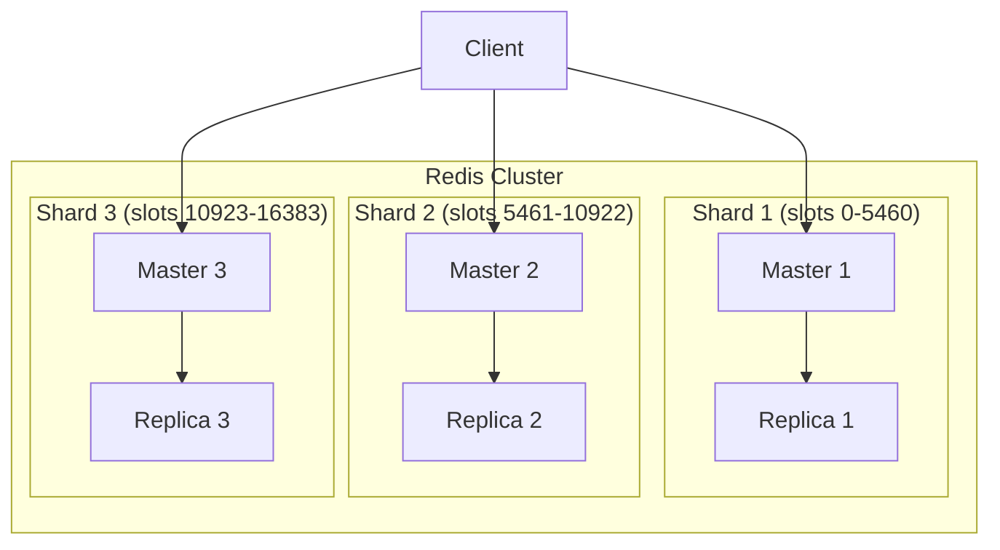

**Key points:**
- 16,384 hash slots distributed across nodes
- Key → slot: `CRC16(key) % 16384`
- Automatic failover: replica promoted if master fails
- Client must handle MOVED redirects

### Cache Sizing

**Formula:**
```
Cache size = Working set × Object size × Overhead

Example:
- 10 million active users
- 1 KB average object size
- 1.5x overhead (Redis metadata, fragmentation)

Size = 10M × 1KB × 1.5 = 15 GB
```

**Hit rate vs size trade-off:**
```
Size        Hit Rate (typical)
1 GB        70%
5 GB        85%
10 GB       92%
20 GB       96%
50 GB       99%

Diminishing returns after ~95% hit rate
```

---

## 8. Real-World Examples

### Facebook's Caching Architecture

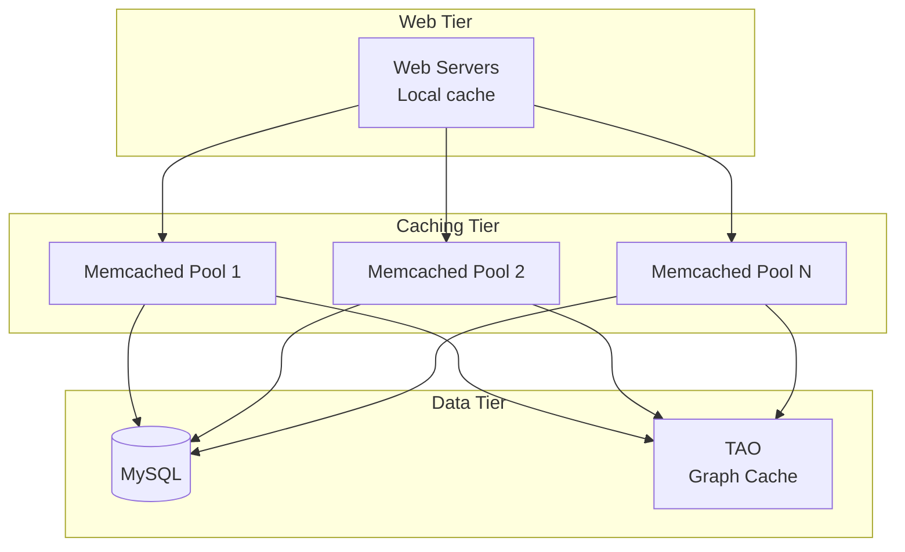

**Key insights:**
- Memcached as lookaside cache
- TAO: Custom graph caching for social data
- Multi-region with invalidation via McRouter
- Lease mechanism to prevent thundering herd

### Twitter's Timeline Caching

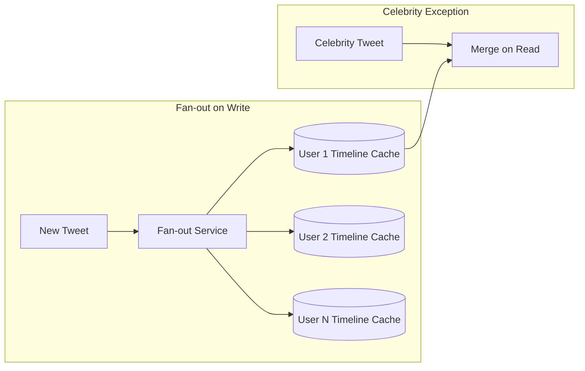

**Key insights:**
- Pre-computed timelines in Redis
- Fan-out writes to followers' cached timelines
- Celebrities: Don't fan-out (too many followers), merge on read
- Hybrid approach based on follower count

---

## 9. Quick Reference

### Caching Checklist

```
□ Identify what to cache (hot data, expensive computations)
□ Choose cache placement (client, CDN, app, distributed)
□ Select caching strategy (cache-aside, write-through, etc.)
□ Set appropriate TTLs (balance freshness vs load)
□ Implement invalidation (event-based for critical data)
□ Handle cache failures gracefully (fall back to DB)
□ Monitor hit rate (target >90%)
□ Plan for cold start (cache warming)
□ Address hot keys (replication, local cache)
□ Prevent stampede (locking, early refresh)
```

### Numbers to Remember

| Metric | Value |
|--------|-------|
| Redis GET latency | 0.1-1ms |
| Memcached GET latency | 0.1-0.5ms |
| Good hit rate | >90% |
| Great hit rate | >95% |
| Redis single node QPS | 100,000+ |
| Memcached single node QPS | 200,000+ |
| Redis max value | 512 MB |
| Memcached max value | 1 MB |

---

## Summary

1. **Why cache**: 50-500x faster than database; hit rate is crucial
2. **Strategies**: Cache-aside (most common), write-through (consistency), write-behind (speed)
3. **Eviction**: LRU for general use, TTL for freshness guarantees
4. **Invalidation**: TTL + event-based is typical; delete on write, populate on read
5. **Problems**: Stampede (use locks), hot keys (replicate), penetration (cache nulls)
6. **Tools**: Redis for features, Memcached for simplicity

**The golden rule**: Cache what's read often, invalidate what's written, and always plan for cache failure.

**Next module**: [Messaging](../../messaging/concepts/concepts.md) - Decoupling with queues and events.