# Module 3: Databases

> "The database is almost always the bottleneck. Scale everything else first, then face the hard problem."

Databases are the hardest component to scale. This module covers the fundamental concepts you need to make informed decisions about data storage.

---

## 1. SQL vs NoSQL

### The Core Difference

**SQL (Relational)**: Data organized in tables with predefined schemas. Relationships enforced. ACID transactions.

**NoSQL**: Flexible schemas, various data models. Optimized for specific access patterns. Usually BASE (not ACID).

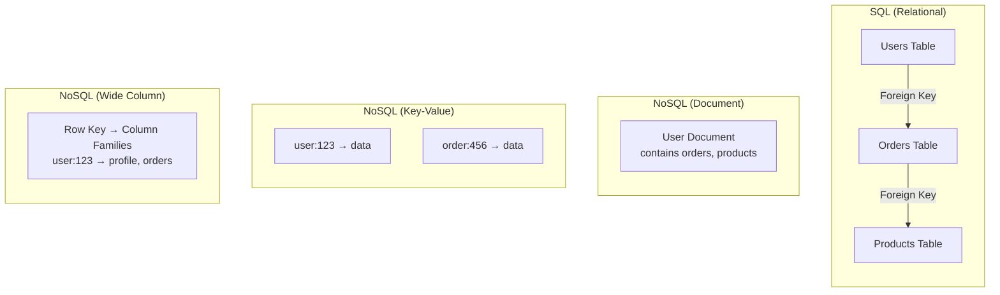

### SQL Databases

**Examples**: PostgreSQL, MySQL, Oracle, SQL Server

**Data Model**:
```sql
-- Rigid schema, normalized data
CREATE TABLE users (
    id SERIAL PRIMARY KEY,
    email VARCHAR(255) UNIQUE NOT NULL,
    name VARCHAR(100) NOT NULL,
    created_at TIMESTAMP DEFAULT NOW()
);

CREATE TABLE orders (
    id SERIAL PRIMARY KEY,
    user_id INTEGER REFERENCES users(id),
    total DECIMAL(10,2) NOT NULL,
    status VARCHAR(20) NOT NULL
);

-- Powerful queries with JOINs
SELECT u.name, COUNT(o.id) as order_count, SUM(o.total) as total_spent
FROM users u
LEFT JOIN orders o ON u.id = o.user_id
GROUP BY u.id
HAVING SUM(o.total) > 1000;
```

**Strengths**:
- Complex queries (JOINs, aggregations, subqueries)
- ACID transactions
- Data integrity (foreign keys, constraints)
- Mature tooling and expertise
- Ad-hoc queries for analytics

**Weaknesses**:
- Horizontal scaling is hard (sharding breaks JOINs)
- Schema changes can be painful
- Not optimized for hierarchical/nested data
- Write scaling limited by single primary

### NoSQL Categories

#### 1. Document Stores

**Examples**: MongoDB, CouchDB, Firestore

**Data Model**:
```json
// Flexible, nested documents
{
  "_id": "user_123",
  "email": "alice@example.com",
  "name": "Alice",
  "orders": [
    {
      "id": "order_456",
      "total": 99.99,
      "items": [
        {"product": "Widget", "qty": 2}
      ]
    }
  ],
  "preferences": {
    "theme": "dark",
    "notifications": true
  }
}
```

**Best for**: Content management, user profiles, catalogs, real-time analytics

**Strengths**: Flexible schema, nested data, horizontal scaling, developer-friendly

**Weaknesses**: No JOINs (must denormalize), weaker consistency guarantees

#### 2. Key-Value Stores

**Examples**: Redis, DynamoDB, Memcached, etcd

**Data Model**:
```
key: "session:abc123"
value: {"user_id": 123, "expires": 1699999999}

key: "user:123:profile"  
value: {"name": "Alice", "email": "alice@example.com"}
```

**Best for**: Caching, sessions, real-time leaderboards, rate limiting

**Strengths**: Extremely fast (O(1) lookups), simple, highly scalable

**Weaknesses**: No complex queries, limited data modeling

#### 3. Wide-Column Stores

**Examples**: Cassandra, HBase, ScyllaDB, Bigtable

**Data Model**:
```
Row Key: "user:123"
├── Column Family: "profile"
│   ├── name: "Alice"
│   ├── email: "alice@example.com"
│   └── created: "2024-01-01"
└── Column Family: "orders"
    ├── order:456: {total: 99.99, status: "shipped"}
    └── order:789: {total: 149.99, status: "pending"}
```

**Best for**: Time-series, IoT, event logging, write-heavy workloads

**Strengths**: Massive write throughput, linear horizontal scaling, no single point of failure

**Weaknesses**: Limited query patterns, eventual consistency, complex operations

#### 4. Graph Databases

**Examples**: Neo4j, Amazon Neptune, JanusGraph

**Data Model**:
```
(Alice)-[:FRIENDS_WITH]->(Bob)
(Alice)-[:PURCHASED]->(Product1)
(Bob)-[:PURCHASED]->(Product1)
(Product1)-[:CATEGORY]->(Electronics)
```

**Best for**: Social networks, recommendations, fraud detection, knowledge graphs

**Strengths**: Relationship traversal, pattern matching, flexible schema

**Weaknesses**: Not for bulk analytics, scaling can be complex

### Decision Matrix

| Factor | SQL | Document | Key-Value | Wide-Column | Graph |
|--------|-----|----------|-----------|-------------|-------|
| **Query flexibility** | ★★★★★ | ★★★☆☆ | ★☆☆☆☆ | ★★☆☆☆ | ★★★★☆ |
| **Horizontal scaling** | ★★☆☆☆ | ★★★★☆ | ★★★★★ | ★★★★★ | ★★★☆☆ |
| **Write throughput** | ★★★☆☆ | ★★★★☆ | ★★★★★ | ★★★★★ | ★★★☆☆ |
| **Transactions** | ★★★★★ | ★★★☆☆ | ★★☆☆☆ | ★★☆☆☆ | ★★★★☆ |
| **Schema flexibility** | ★★☆☆☆ | ★★★★★ | ★★★★★ | ★★★★☆ | ★★★★★ |
| **Relationships** | ★★★★☆ | ★★☆☆☆ | ★☆☆☆☆ | ★★☆☆☆ | ★★★★★ |

### When to Use What

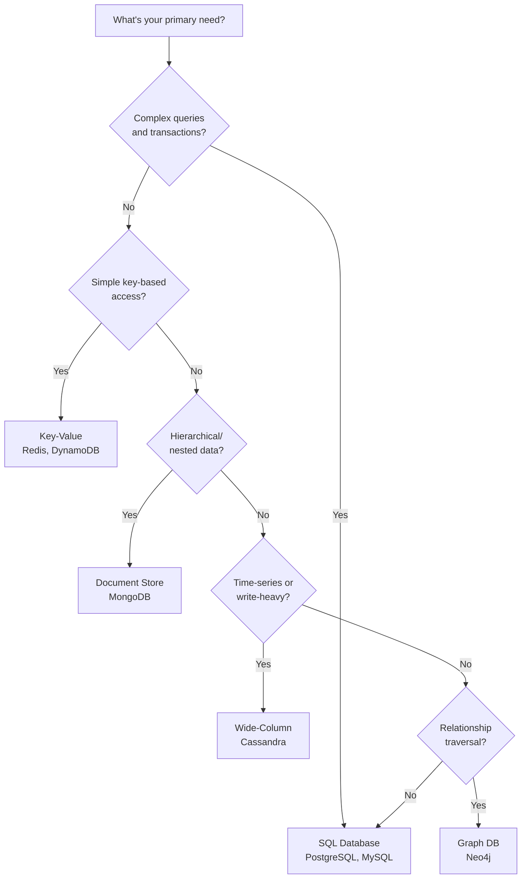

---

## 2. ACID Properties

### What is ACID?

ACID guarantees data validity despite errors, crashes, or concurrent access.

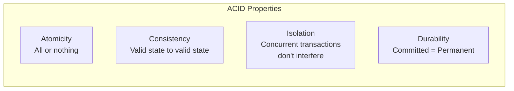

### Atomicity

**Definition**: A transaction is all-or-nothing. If any part fails, the entire transaction is rolled back.

**Example - Bank Transfer**:
```sql
BEGIN TRANSACTION;
    UPDATE accounts SET balance = balance - 100 WHERE id = 1;  -- Debit
    UPDATE accounts SET balance = balance + 100 WHERE id = 2;  -- Credit
COMMIT;

-- If either UPDATE fails, BOTH are rolled back
-- No partial transfers (money doesn't disappear)
```

**Without atomicity**: Power failure after debit but before credit = lost money.

### Consistency

**Definition**: A transaction brings the database from one valid state to another. All constraints, triggers, and rules are enforced.

**Example**:
```sql
-- Constraint: balance >= 0
ALTER TABLE accounts ADD CONSTRAINT positive_balance CHECK (balance >= 0);

BEGIN TRANSACTION;
    UPDATE accounts SET balance = balance - 1000 WHERE id = 1;
    -- If account 1 has only $500, this FAILS
    -- Consistency constraint violated → Transaction rolled back
COMMIT;
```

### Isolation

**Definition**: Concurrent transactions execute as if they were sequential. One transaction doesn't see another's uncommitted changes.

**The Problem Without Isolation**:
```
Time    Transaction A              Transaction B
─────   ─────────────────────     ─────────────────────
T1      READ balance (=$100)
T2                                 READ balance (=$100)
T3      balance = 100 - 50
T4      WRITE balance (=$50)
T5                                 balance = 100 + 30
T6                                 WRITE balance (=$130)

Result: $130 (Transaction A's debit was lost!)
Expected: $80 ($100 - $50 + $30)
```

**Isolation Levels**:

| Level | Dirty Reads | Non-Repeatable Reads | Phantom Reads | Performance |
|-------|-------------|----------------------|---------------|-------------|
| Read Uncommitted | ✗ Allowed | ✗ Allowed | ✗ Allowed | Fastest |
| Read Committed | ✓ Prevented | ✗ Allowed | ✗ Allowed | Fast |
| Repeatable Read | ✓ Prevented | ✓ Prevented | ✗ Allowed | Medium |
| Serializable | ✓ Prevented | ✓ Prevented | ✓ Prevented | Slowest |

**Read Anomalies Explained**:

```
Dirty Read: Reading uncommitted data from another transaction
            → Transaction B might rollback, you read invalid data

Non-Repeatable Read: Same query returns different results
            → Another transaction modified data between your reads

Phantom Read: Same query returns different ROWS
            → Another transaction inserted/deleted rows matching your query
```

### Durability

**Definition**: Once a transaction commits, it survives system crashes, power failures, etc.

**How it works**:
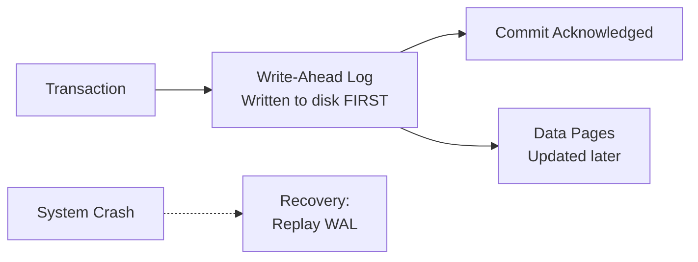

**Key mechanism**: Write-Ahead Logging (WAL)
- Changes written to log before data files
- On crash, replay log to recover committed transactions
- Durability comes at cost of write latency (fsync)

### ACID vs BASE

**BASE** (Basically Available, Soft state, Eventually consistent) - common in NoSQL:

| Property | ACID | BASE |
|----------|------|------|
| Consistency | Strong (immediate) | Eventual |
| Availability | May block for consistency | Prioritizes availability |
| Use case | Banking, inventory | Social feeds, analytics |
| Scaling | Harder | Easier |

---

## 3. Indexing

### Why Indexes Matter

Without index: **Full table scan** - O(n)
With index: **Index lookup** - O(log n) or O(1)

```
Table: 10 million rows
Without index: Scan all 10M rows → ~10 seconds
With B-tree index: ~20 disk reads → ~2ms
                   5000x faster
```

### B-Tree Index (Default)

**Structure**:
```
                    [50]
                   /    \
            [20,30]      [70,80]
           /   |   \    /   |   \
        [10] [25] [35] [60] [75] [90]
         ↓    ↓    ↓    ↓    ↓    ↓
       Data Data Data Data Data Data
```

**Properties**:
- Balanced tree (all leaves at same depth)
- Each node contains multiple keys
- Sorted order maintained
- O(log n) for search, insert, delete

**Best for**:
- Equality queries: `WHERE id = 123`
- Range queries: `WHERE date BETWEEN '2024-01-01' AND '2024-12-31'`
- Sorting: `ORDER BY created_at`
- Prefix matching: `WHERE name LIKE 'John%'`

**Not good for**:
- Suffix matching: `WHERE name LIKE '%son'` (can't use index)
- Functions on columns: `WHERE YEAR(created_at) = 2024` (can't use index)

### Hash Index

**Structure**:
```
hash("alice@example.com") → bucket 7 → row pointer
hash("bob@example.com")   → bucket 3 → row pointer
```

**Properties**:
- O(1) lookups for exact matches
- No ordering (can't do range queries)
- Fixed size buckets

**Best for**:
- Equality only: `WHERE email = 'alice@example.com'`
- In-memory databases (Redis)

**Not good for**:
- Range queries: `WHERE age > 30`
- Sorting: `ORDER BY email`

### Composite Index

Index on multiple columns:

```sql
CREATE INDEX idx_user_status_date ON orders(user_id, status, created_at);
```

**Column order matters** (leftmost prefix rule):

```sql
-- ✓ Uses index (all columns, left to right)
WHERE user_id = 1 AND status = 'pending' AND created_at > '2024-01-01'

-- ✓ Uses index (leftmost columns)
WHERE user_id = 1 AND status = 'pending'

-- ✓ Uses index (leftmost column only)
WHERE user_id = 1

-- ✗ Cannot use index (skipped user_id)
WHERE status = 'pending'

-- ✗ Cannot use index (skipped user_id and status)
WHERE created_at > '2024-01-01'
```

### Covering Index

Index contains all columns needed for query:

```sql
CREATE INDEX idx_covering ON orders(user_id, status, total);

-- Query only needs index, never touches table
SELECT status, total FROM orders WHERE user_id = 123;
```

**Benefit**: Avoids "index lookup + table lookup" = faster

### Index Trade-offs

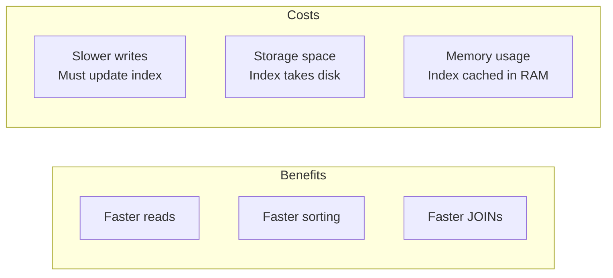

**Numbers**:
- Each index adds ~10-30% write overhead
- Index size typically 10-30% of table size
- Too many indexes = slow inserts/updates

### Index Selection Guidelines

```
1. Primary key: Always indexed (automatic)

2. Foreign keys: Index them for JOIN performance
   CREATE INDEX idx_orders_user_id ON orders(user_id);

3. Columns in WHERE clauses: Index if high selectivity
   High selectivity: email, user_id (few rows match)
   Low selectivity: status, gender (many rows match)

4. Columns in ORDER BY: Index if frequently sorted

5. Composite indexes: Most selective column first
```

### Explain Plans

Always verify index usage:

```sql
EXPLAIN ANALYZE SELECT * FROM orders WHERE user_id = 123;

-- Good output:
Index Scan using idx_orders_user_id on orders
  Index Cond: (user_id = 123)
  Rows: 50
  Time: 0.5ms

-- Bad output:
Seq Scan on orders
  Filter: (user_id = 123)
  Rows: 50 (out of 10000000 scanned)
  Time: 8500ms
```

---

## 4. Replication

### Why Replicate?

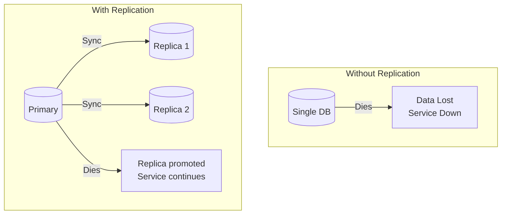

**Goals**:
1. **High availability**: Survive node failures
2. **Read scaling**: Distribute read load
3. **Geographic distribution**: Data closer to users
4. **Backup**: Point-in-time recovery

### Replication Topologies

#### Single Leader (Primary-Replica)

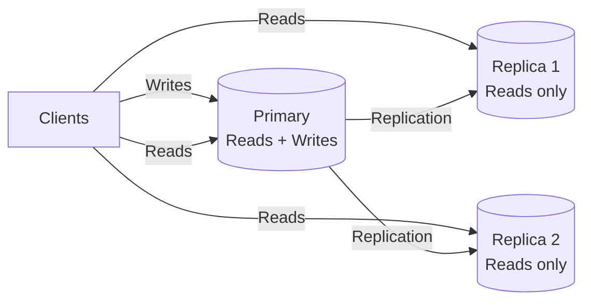

**How it works**:
- One primary accepts all writes
- Replicas receive changes via replication log
- Replicas serve read queries

**Trade-offs**:
| Aspect | Pro | Con |
|--------|-----|-----|
| Consistency | Easy to reason about | Write bottleneck |
| Failover | Well understood | Requires leader election |
| Read scaling | Add more replicas | Writes don't scale |

#### Multi-Leader

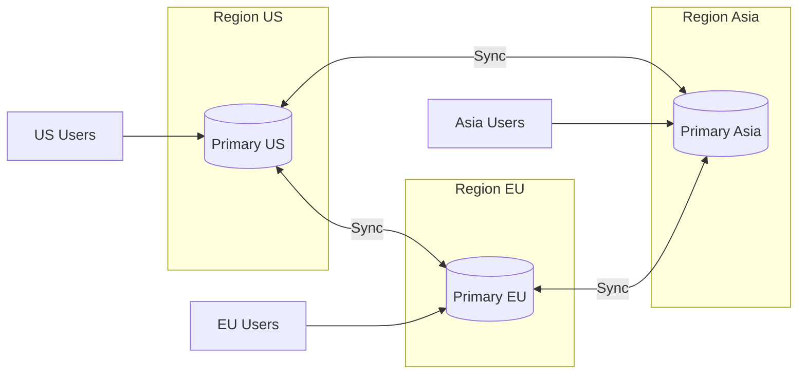

**Use case**: Multi-region deployments with local writes

**The big problem**: Conflict resolution

```
User updates profile in US: name = "Alice Smith"
User updates profile in EU: name = "Alice Johnson"
Both happen at same time → Which wins?

Conflict resolution strategies:
- Last write wins (timestamp)
- Merge changes (CRDTs)
- Application-level resolution
- Flag for manual resolution
```

#### Leaderless (Dynamo-style)

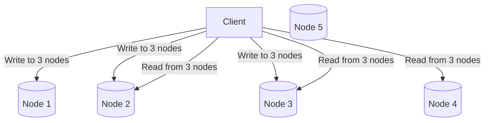

**Quorum**: W + R > N ensures consistency
- N = total nodes (e.g., 5)
- W = write acknowledgments needed (e.g., 3)
- R = read nodes queried (e.g., 3)
- 3 + 3 > 5 → guaranteed overlap

**Examples**: Cassandra, DynamoDB, Riak

### Synchronous vs Asynchronous Replication

#### Synchronous

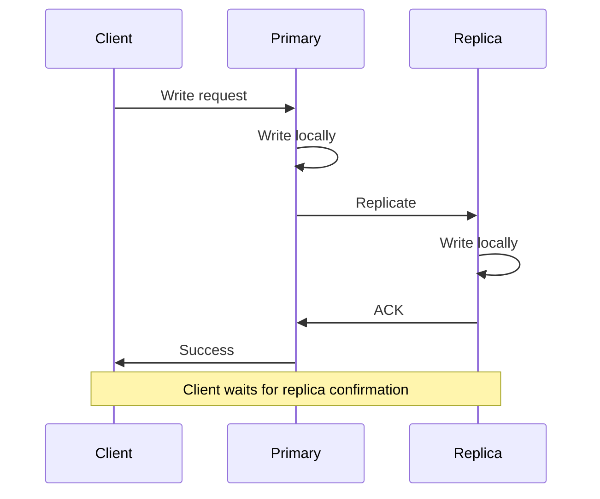

**Properties**:
- Guaranteed consistency (replica has all committed data)
- Higher latency (wait for replica)
- Lower availability (if replica down, writes block)

#### Asynchronous

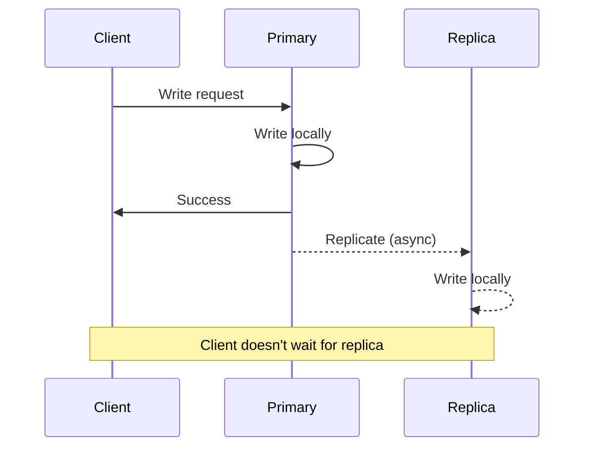

**Properties**:
- Lower latency (don't wait for replica)
- Higher availability (replica issues don't block writes)
- Replication lag (replica may be behind)
- Data loss risk (primary dies before replicating)

### Replication Lag

**The problem**:
```
Time 0: User updates profile on Primary
Time 1: Primary acknowledges success
Time 2: User reads from Replica → sees OLD data!
Time 3: Replication catches up
Time 4: User reads from Replica → sees new data
```

**Typical lag**:
- Same datacenter: 1-10ms
- Cross-region: 100-500ms
- Under load: seconds to minutes

**Mitigation strategies**:

| Strategy | Description | Use When |
|----------|-------------|----------|
| Read-your-writes | Route user's reads to primary after their writes | User-specific data |
| Monotonic reads | Stick user to same replica | Avoid going "back in time" |
| Causal consistency | Track dependencies, ensure order | Related operations |
| Strong consistency | Synchronous replication | Critical data |

---

## 5. Sharding (Partitioning)

### Why Shard?

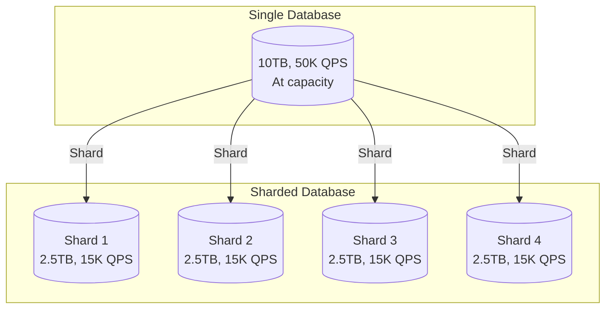

**When you need sharding**:
- Single database can't handle write throughput
- Data too large for one machine
- Read replicas aren't enough

### Sharding Strategies

#### 1. Range-Based Sharding

```
Shard by user_id ranges:
├── Shard 1: user_id 1 - 1,000,000
├── Shard 2: user_id 1,000,001 - 2,000,000
├── Shard 3: user_id 2,000,001 - 3,000,000
└── Shard 4: user_id 3,000,001 - 4,000,000
```

**Pros**:
- Range queries efficient (all data on one shard)
- Easy to understand

**Cons**:
- Hot spots (new users all hit last shard)
- Uneven distribution over time

#### 2. Hash-Based Sharding

```python
shard_id = hash(user_id) % num_shards

# user_id = 12345
# hash(12345) = 987654321
# 987654321 % 4 = 1
# → Route to Shard 1
```

**Pros**:
- Even distribution
- No hot spots

**Cons**:
- Range queries must hit all shards
- Adding shards requires redistribution

#### 3. Consistent Hashing

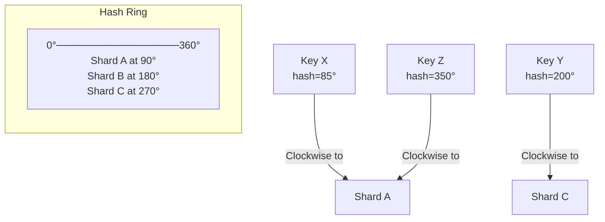

**Properties**:
- Adding/removing shard only affects neighbors
- Virtual nodes for better distribution
- Used by: Cassandra, DynamoDB, Memcached

#### 4. Directory-Based Sharding

```
Lookup Table:
├── user_id 1-1000 → Shard A
├── user_id 1001-5000 → Shard B
├── user_id 5001-5050 → Shard C (VIP users, dedicated)
└── user_id 5051+ → Shard D
```

**Pros**:
- Flexible placement
- Can isolate hot users

**Cons**:
- Lookup service is single point of failure
- Additional latency for lookup

### Shard Key Selection

**Critical decision**: Once chosen, very hard to change.

```
Good shard keys:
✓ user_id - queries are user-scoped
✓ tenant_id - multi-tenant SaaS
✓ region - geographic isolation

Bad shard keys:
✗ timestamp - hot spot on latest shard
✗ auto-increment id - all writes to one shard
✗ low-cardinality (status) - uneven distribution
```

### Cross-Shard Operations

**The hard problem**: Operations spanning multiple shards

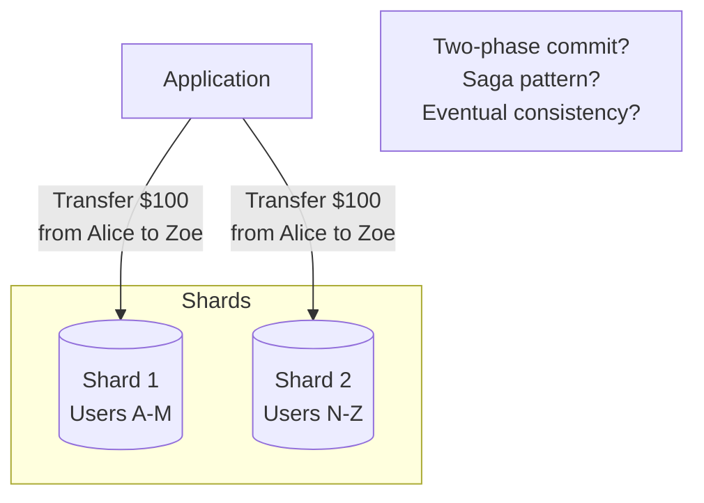

**Solutions**:

| Approach | Description | Trade-off |
|----------|-------------|-----------|
| Avoid them | Design schema to keep related data together | Limits flexibility |
| Two-phase commit | Distributed transaction | Slow, complex, availability risk |
| Saga pattern | Sequence of local transactions with compensation | Eventually consistent |
| Application logic | Handle in application code | Complexity in app |

### Sharding at Scale: Real Examples

**Instagram (2012)**:
- Sharded PostgreSQL by user_id
- Each shard: primary + 2 replicas
- Custom ID generation (timestamp + shard + sequence)

**Uber**:
- Sharded by geography (city)
- Local queries stay on one shard
- Cross-city trips require coordination

**Discord**:
- Sharded by guild_id (server)
- Messages stay with their guild
- Users span multiple shards

---

## 6. Database Selection Guide

### Decision Framework

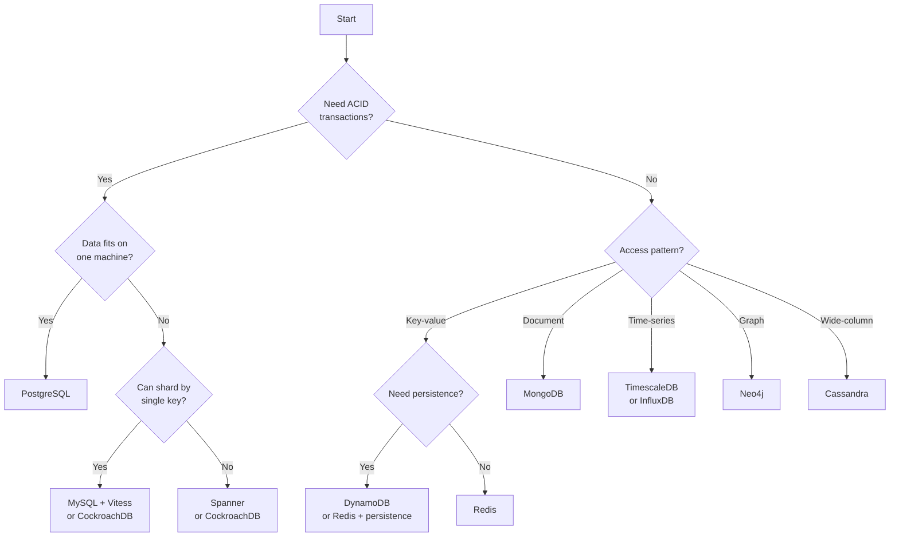

### Quick Reference

| Use Case | Recommended | Why |
|----------|-------------|-----|
| General web app | PostgreSQL | Flexible, reliable, great tooling |
| High-write throughput | Cassandra, ScyllaDB | Linear write scaling |
| Caching | Redis | Speed, data structures |
| Document storage | MongoDB | Flexible schema, good DX |
| Search | Elasticsearch | Full-text, aggregations |
| Analytics (OLAP) | ClickHouse, BigQuery | Columnar, fast aggregations |
| Global distribution | CockroachDB, Spanner | Distributed SQL |
| Time-series | TimescaleDB, InfluxDB | Time-based partitioning |

---

## 7. Numbers to Know

### Database Performance Benchmarks

| Operation | PostgreSQL | MySQL | MongoDB | Cassandra | Redis |
|-----------|------------|-------|---------|-----------|-------|
| Simple read | 5,000-20,000 QPS | 5,000-20,000 QPS | 10,000-30,000 QPS | 10,000-50,000 QPS | 100,000+ QPS |
| Simple write | 1,000-10,000 QPS | 1,000-10,000 QPS | 5,000-20,000 QPS | 10,000-50,000 QPS | 100,000+ QPS |
| Complex query | 100-1,000 QPS | 100-1,000 QPS | N/A | N/A | N/A |

*Highly dependent on hardware, schema, queries, and configuration*

### Storage Sizes

| Data | Approximate Size |
|------|------------------|
| UUID | 16 bytes |
| Timestamp | 8 bytes |
| Integer (32-bit) | 4 bytes |
| Integer (64-bit) | 8 bytes |
| VARCHAR(255) | 1-255 bytes + overhead |
| TEXT | Variable + overhead |
| JSON document | Variable (typically 1KB-10KB) |
| Row overhead (PostgreSQL) | ~24 bytes |
| Index entry | ~40-100 bytes per row |

### Replication Lag Targets

| Scenario | Acceptable Lag |
|----------|----------------|
| Same datacenter | < 10ms |
| Cross-region | < 1 second |
| Analytics replica | < 1 minute |
| Backup replica | < 1 hour |

---

## Summary

1. **SQL vs NoSQL**: SQL for complex queries and transactions. NoSQL for scale and specific access patterns. Often use both.

2. **ACID**: Atomicity (all or nothing), Consistency (valid states), Isolation (concurrent safety), Durability (survives crashes).

3. **Indexing**: B-trees for range queries, hash for equality. Composite index column order matters. Every index slows writes.

4. **Replication**: Single-leader is simplest. Async is faster but has lag. Sync is consistent but slower.

5. **Sharding**: Range for locality, hash for distribution, consistent hash for flexibility. Shard key selection is critical.

**The golden rule**: Start with PostgreSQL. Add caching. Add read replicas. Only shard when you absolutely must.

**Next module**: [Caching](../../caching/concepts/concepts.md) - How to avoid hitting the database.