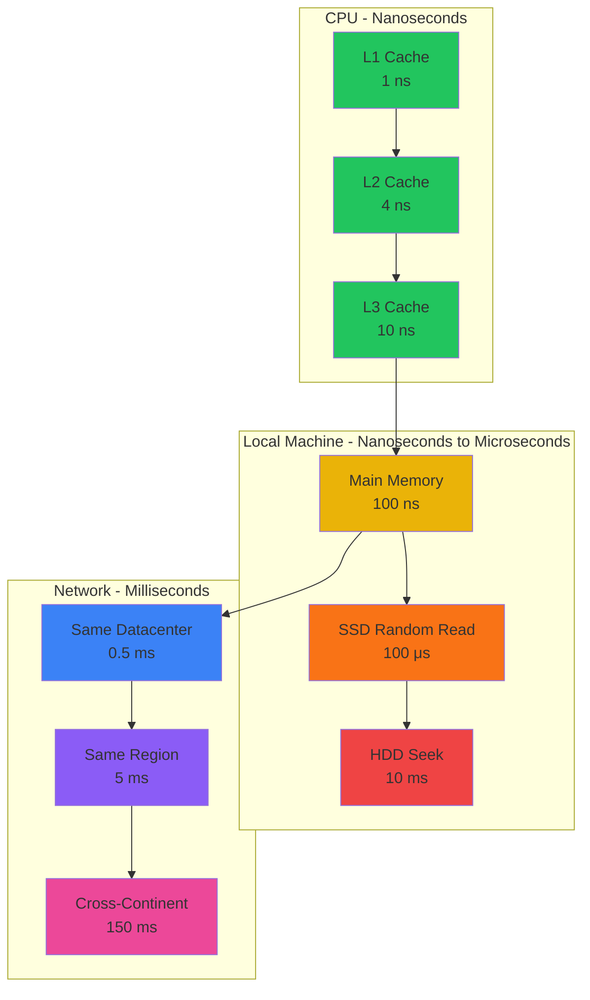
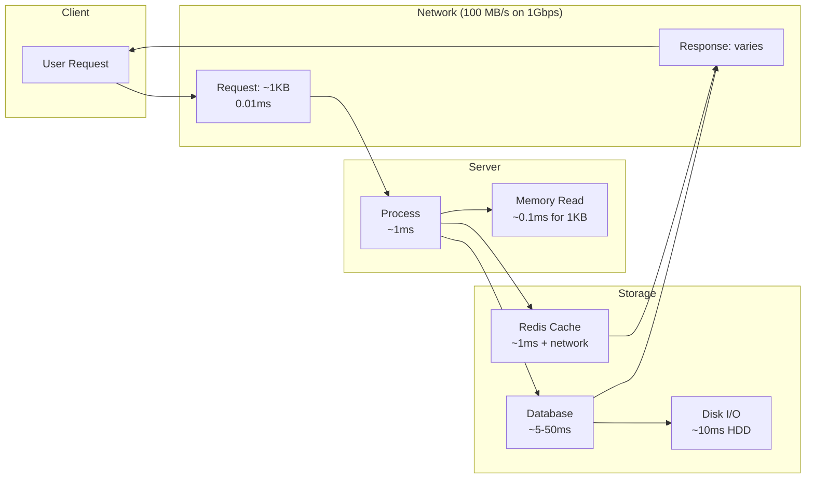
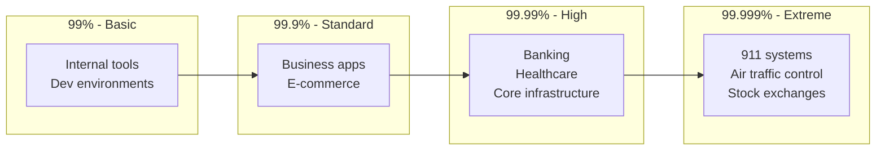
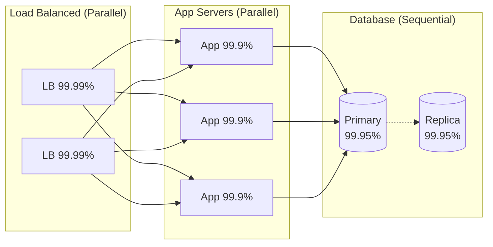
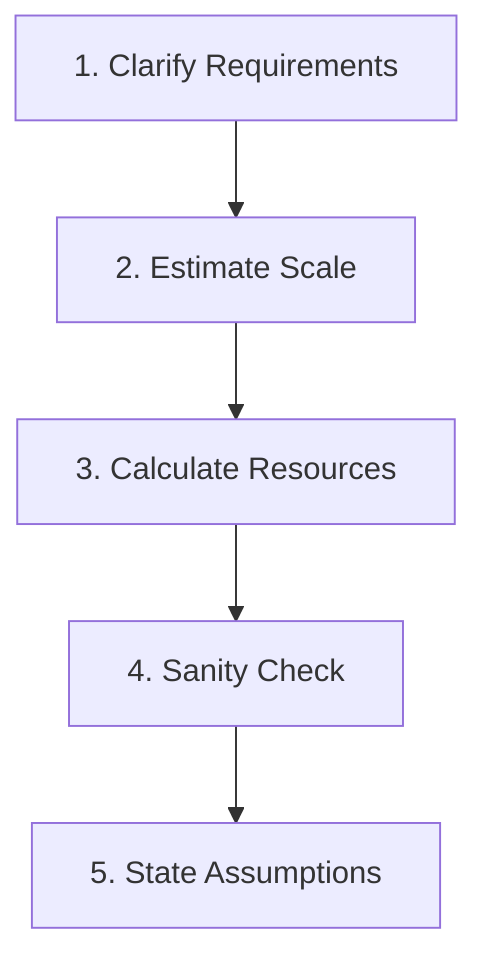
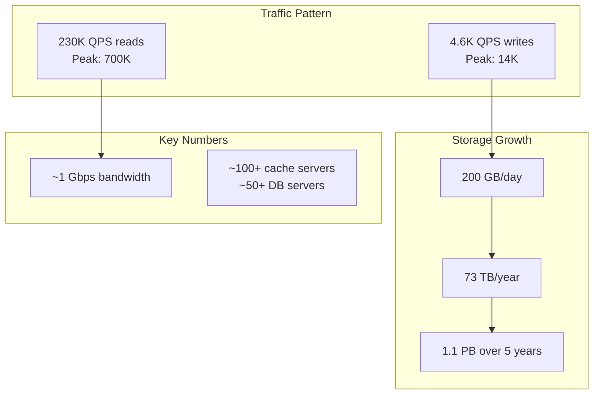
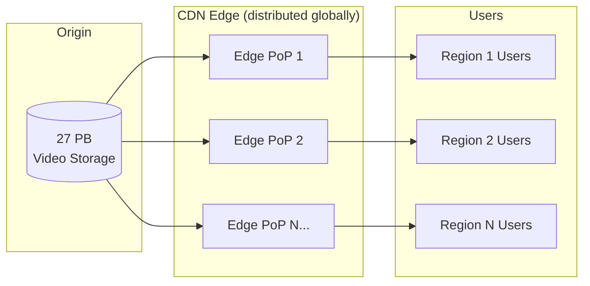

# Module 1: Fundamentals

> "You can't design systems you can't estimate. You can't estimate systems you don't understand."

This module is the foundation. Master these numbers and techniques, and every subsequent design decision becomes grounded in reality.

---

## 1. Latency Numbers Every Engineer Should Know

### The Memory Hierarchy



### The Latency Table (Memorize This)

| Operation | Latency | Relative to 1 sec if L1 = 1 sec |
|-----------|---------|--------------------------------|
| L1 cache reference | 1 ns | 1 second |
| Branch mispredict | 3 ns | 3 seconds |
| L2 cache reference | 4 ns | 4 seconds |
| Mutex lock/unlock | 17 ns | 17 seconds |
| Main memory reference | 100 ns | 1.5 minutes |
| Compress 1KB with Zippy | 2 μs | 35 minutes |
| Send 2KB over 1 Gbps network | 20 μs | 5.5 hours |
| SSD random read | 100 μs | 1.1 days |
| Read 1 MB sequentially from memory | 250 μs | 2.9 days |
| Round trip within same datacenter | 500 μs | 5.8 days |
| Read 1 MB sequentially from SSD | 1 ms | 11.6 days |
| HDD seek | 10 ms | 16.5 weeks |
| Read 1 MB sequentially from HDD | 20 ms | 7.8 months |
| Send packet CA → Netherlands → CA | 150 ms | 4.8 years |

### Key Insights

**Why this matters for design:**

1. **Memory vs Disk**: RAM is ~100,000x faster than HDD seeks. This is why caching works.

2. **SSD vs HDD**: SSD random reads are 100x faster than HDD seeks. This is why SSDs transformed databases.

3. **Network is slow**: A cross-datacenter call takes 150ms. That's 150,000 memory operations. Minimize network calls.

4. **Sequential vs Random**: Reading 1MB sequentially from SSD (1ms) is 10x slower than reading 1MB from memory (250μs). But random access patterns are the killer.

### The Latency Pyramid (Visual Memorization)

```
                    △ L1 Cache (1ns)
                   ╱ ╲
                  ╱   ╲ L2 Cache (4ns)
                 ╱     ╲
                ╱ Memory ╲ (100ns = 100x L1)
               ╱    ▽     ╲
              ╱     SSD    ╲ (100μs = 1000x Memory)
             ╱       ▽      ╲
            ╱    Same DC     ╲ (500μs = 5x SSD)
           ╱        ▽         ╲
          ╱     Cross-Region   ╲ (150ms = 300x Same DC)
         ▔▔▔▔▔▔▔▔▔▔▔▔▔▔▔▔▔▔▔▔▔▔▔
```

**Memory trick**: Each level is roughly 10-1000x slower than the one above.

---

## 2. Throughput Numbers

### Storage Throughput

| Storage Type | Sequential Read | Sequential Write | Random IOPS |
|--------------|-----------------|------------------|-------------|
| HDD (7200 RPM) | 100-150 MB/s | 100-150 MB/s | 100-200 IOPS |
| SATA SSD | 500-550 MB/s | 450-500 MB/s | 90,000 IOPS |
| NVMe SSD | 3,000-7,000 MB/s | 2,000-5,000 MB/s | 500,000+ IOPS |
| RAM | 20,000+ MB/s | 20,000+ MB/s | N/A |

### Network Throughput

| Network Type | Theoretical | Practical (~80%) | MB/s |
|--------------|-------------|------------------|------|
| 1 Gbps | 1,000 Mbps | 800 Mbps | 100 MB/s |
| 10 Gbps | 10,000 Mbps | 8,000 Mbps | 1,000 MB/s |
| 25 Gbps | 25,000 Mbps | 20,000 Mbps | 2,500 MB/s |
| 100 Gbps | 100,000 Mbps | 80,000 Mbps | 10,000 MB/s |

**Key insight**: Network is often the bottleneck, not disk.

### Data Flow Diagram



---

## 3. Availability: The "Nines"

### What Do the Nines Mean?

| Availability | Downtime/Year | Downtime/Month | Downtime/Week |
|--------------|---------------|----------------|---------------|
| 99% (two 9s) | 3.65 days | 7.2 hours | 1.68 hours |
| 99.9% (three 9s) | 8.76 hours | 43.8 minutes | 10.1 minutes |
| 99.95% | 4.38 hours | 21.9 minutes | 5 minutes |
| 99.99% (four 9s) | 52.6 minutes | 4.38 minutes | 1.01 minutes |
| 99.999% (five 9s) | 5.26 minutes | 26.3 seconds | 6.05 seconds |

### Real-World Availability Targets



### Calculating System Availability

**Sequential components** (all must work):
```
Overall = A₁ × A₂ × A₃ × ... × Aₙ
```

**Parallel components** (any can work):
```
Overall = 1 - (1 - A₁) × (1 - A₂) × ... × (1 - Aₙ)
```

### Example: Web Application Architecture



**Calculation:**

1. Load Balancers (parallel): `1 - (1 - 0.9999)² = 1 - 0.00000001 = 99.999999%`

2. App Servers (parallel): `1 - (1 - 0.999)³ = 1 - 0.000000001 = 99.9999999%`

3. Database with replica (parallel): `1 - (1 - 0.9995)² = 99.999975%`

4. Overall (sequential): `0.99999999 × 0.999999999 × 0.99999975 ≈ 99.9999%`

**Key insight**: Your system is only as reliable as its weakest sequential component. One 99% component in a serial chain destroys four-nines availability.

### The Cost of Nines

```
         Cost ($)
           │
           │                              ★ 99.999%
           │                        ●
           │                  ●
           │            ●
           │      ●
           │ ●
           └──────────────────────────────────
                    99%   99.9%  99.99%  99.999%
                         Availability
```

Each additional "9" roughly **10x the cost** due to:
- Redundant infrastructure
- More sophisticated monitoring
- Faster incident response teams
- Geographic distribution
- Better hardware

---

## 4. Back-of-Envelope Calculations

### The Framework

Every estimation follows this pattern:



### Essential Powers of 2

| Power | Exact | Approximation |
|-------|-------|---------------|
| 2¹⁰ | 1,024 | ~1 thousand (1 KB) |
| 2²⁰ | 1,048,576 | ~1 million (1 MB) |
| 2³⁰ | 1,073,741,824 | ~1 billion (1 GB) |
| 2⁴⁰ | 1,099,511,627,776 | ~1 trillion (1 TB) |

### Time Conversions (Memorize)

| Period | Seconds |
|--------|---------|
| 1 day | 86,400 ≈ **100,000** |
| 1 month | 2.6M ≈ **2.5 million** |
| 1 year | 31.5M ≈ **30 million** |

### Common Estimation Formulas

**QPS (Queries Per Second):**
```
QPS = Daily Active Users × Actions per User / 86,400
Peak QPS = QPS × 2 to 3 (or higher for spiky traffic)
```

**Storage:**
```
Storage = Users × Data per User × Retention Period × Replication Factor
```

**Bandwidth:**
```
Bandwidth = QPS × Average Request Size
```

**Servers Needed:**
```
Servers = Peak QPS / QPS per Server
```

---

## 5. Worked Examples

### Example 1: Twitter-like Timeline Service

**Requirements clarification:**
- 500M monthly active users
- 200M daily active users (DAU)
- Each user reads 100 tweets/day
- Each user posts 2 tweets/day
- Average tweet size: 500 bytes (including metadata)
- Store tweets for 5 years

**Step 1: QPS Calculations**

```
Read QPS:
= 200M users × 100 reads/day / 86,400 sec/day
= 20 billion / 86,400
≈ 230,000 QPS

Write QPS:
= 200M users × 2 tweets/day / 86,400 sec/day
= 400M / 86,400
≈ 4,600 QPS

Peak (3x average):
Read: ~700,000 QPS
Write: ~14,000 QPS
```

**Step 2: Storage Calculations**

```
Daily new tweets:
= 200M users × 2 tweets
= 400M tweets/day

Daily storage:
= 400M × 500 bytes
= 200 GB/day

5-year storage:
= 200 GB × 365 × 5
= 365 TB

With 3x replication:
≈ 1.1 PB
```

**Step 3: Bandwidth**

```
Outgoing (reads):
= 230,000 QPS × 500 bytes
= 115 MB/s
= 920 Mbps

Peak: ~2.8 Gbps outgoing
```



### Example 2: URL Shortener

**Requirements:**
- 100M new URLs/month
- 10:1 read to write ratio
- URLs stored for 10 years
- Average long URL: 200 bytes
- Short URL: 7 characters

**Calculations:**

```
Write QPS:
= 100M / (30 days × 86,400 sec)
= 100M / 2.6M
≈ 40 QPS

Read QPS:
= 40 × 10
= 400 QPS

Peak (5x): 2,000 QPS reads, 200 QPS writes
```

```
Storage per URL:
= 7 (short) + 200 (long) + 50 (metadata)
= 257 bytes ≈ 300 bytes

10-year storage:
= 100M/month × 12 × 10 × 300 bytes
= 12 billion URLs × 300 bytes
= 3.6 TB

With replication (3x):
≈ 11 TB
```

**How many unique short URLs can 7 characters support?**

```
Using [a-zA-Z0-9]:
= 62^7
= 3.5 trillion URLs

This is way more than 12 billion needed. ✓
```

### Example 3: Video Streaming Service

**Requirements:**
- 100M daily active users
- Average watch time: 1 hour/day
- Average video bitrate: 5 Mbps
- Store 1M hours of video content

**Bandwidth calculation:**

```
Concurrent viewers (assume 10% at peak):
= 100M × 0.1 = 10M concurrent

Bandwidth needed:
= 10M × 5 Mbps
= 50 Pbps (petabits per second)
= 50,000 Tbps

This is why CDNs exist!
```

**Storage calculation:**

```
1 hour of video at 5 Mbps:
= 5 Mbps × 3600 seconds / 8
= 2.25 GB per hour

1M hours of content:
= 1M × 2.25 GB
= 2.25 PB

Multiple resolutions (4 versions):
≈ 9 PB

With redundancy:
≈ 27 PB
```



---

## 6. Common Pitfalls

### ❌ Mistake 1: Forgetting Peak Traffic

```
Average QPS: 1,000
Peak QPS: Could be 5-10x during events

Design for peak, not average!
```

### ❌ Mistake 2: Ignoring Replication

```
Raw storage: 100 TB
With 3x replication: 300 TB
With backups: 400+ TB
```

### ❌ Mistake 3: Underestimating Metadata

```
User record "seems small":
- Username: 50 bytes
- Email: 100 bytes
- But also: indexes, timestamps, audit logs, 
  soft deletes, schema overhead...

Reality: 50 bytes → 500+ bytes
```

### ❌ Mistake 4: Linear Thinking

```
1 server handles 1,000 QPS
10,000 QPS needs 10 servers?

No! You also need:
- Load balancers
- Database scaling (which is harder)
- Network capacity
- Coordination overhead
```

---

## 7. Quick Reference Card

### The Numbers

```
┌─────────────────────────────────────────────────┐
│           LATENCY (memorize these!)             │
├─────────────────────────────────────────────────┤
│ L1 cache:           1 ns                        │
│ Memory:             100 ns                      │
│ SSD random read:    100 μs                      │
│ HDD seek:           10 ms                       │
│ Same datacenter:    0.5 ms                      │
│ Cross-continent:    150 ms                      │
├─────────────────────────────────────────────────┤
│           THROUGHPUT                            │
├─────────────────────────────────────────────────┤
│ SSD sequential:     500 MB/s                    │
│ HDD sequential:     100 MB/s                    │
│ 1 Gbps network:     100 MB/s                    │
│ 10 Gbps network:    1 GB/s                      │
├─────────────────────────────────────────────────┤
│           TIME CONVERSIONS                      │
├─────────────────────────────────────────────────┤
│ 1 day:              ~100,000 seconds            │
│ 1 month:            ~2.5 million seconds        │
│ 1 year:             ~30 million seconds         │
├─────────────────────────────────────────────────┤
│           AVAILABILITY                          │
├─────────────────────────────────────────────────┤
│ 99.9%:              8.7 hours downtime/year     │
│ 99.99%:             52 minutes downtime/year    │
│ 99.999%:            5 minutes downtime/year     │
└─────────────────────────────────────────────────┘
```

### The Formulas

```
QPS = DAU × actions_per_user / 86,400
Storage = users × data_per_user × retention × replication
Bandwidth = QPS × request_size
Availability (parallel) = 1 - ∏(1 - Aᵢ)
Availability (serial) = ∏Aᵢ
```

---

## Summary

**What you should now understand:**

1. **Latency hierarchy**: Cache → Memory → SSD → HDD → Network (each ~100-1000x slower)

2. **Why caching works**: 100ns memory vs 10ms disk = 100,000x difference

3. **Availability math**: Serial components multiply, parallel components use `1 - ∏(1-A)`

4. **Estimation framework**: Clarify → Scale → Calculate → Sanity check → Assumptions

5. **The critical numbers**: Memorize the latency table. It's the foundation of all design intuition.

**Next module**: [Scaling](../scaling/concepts/concepts.md) - How to handle growth when these numbers aren't enough.