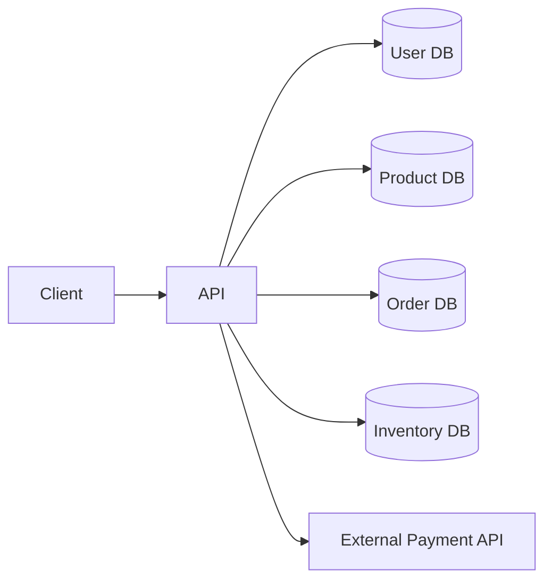

# Module 1: Fundamentals - Practice

Test your understanding of latency, throughput, availability, and estimation.

---

## Section 1: Fill in the Blanks (Latency Numbers)

Fill in the missing values. Check your answers at the bottom.

### Exercise 1.1: Memory Hierarchy

```
L1 cache reference:      ___ ns
L2 cache reference:      ___ ns
Main memory reference:   ___ ns
SSD random read:         ___ μs
HDD seek:                ___ ms
```

### Exercise 1.2: Network Latency

```
Round trip, same datacenter:    ___ ms
Round trip, cross-continent:    ___ ms
Send 2KB over 1 Gbps network:   ___ μs
```

### Exercise 1.3: Throughput

```
SSD sequential read:     ___ MB/s
HDD sequential read:     ___ MB/s
1 Gbps network:          ___ MB/s
10 Gbps network:         ___ GB/s
```

### Exercise 1.4: Time Conversions

```
Seconds in a day:    ___________  (approximate)
Seconds in a month:  ___________  (approximate)
Seconds in a year:   ___________  (approximate)
```

---

## Section 2: Availability Calculations

### Exercise 2.1: Simple Sequential System

A system has three components in series:
- API Gateway: 99.9% availability
- Application Server: 99.9% availability  
- Database: 99.5% availability

**Question**: What is the overall system availability?

Your calculation:
```
Overall = ___ × ___ × ___
        = ____%
```

### Exercise 2.2: Parallel Redundancy

You have two load balancers, each with 99.9% availability, in an active-active configuration.

**Question**: What is the combined availability of the load balancer tier?

Your calculation:
```
Combined = 1 - (1 - ___) × (1 - ___)
         = 1 - ___ × ___
         = ____%
```

### Exercise 2.3: Mixed Architecture

```
              ┌─────────────────────┐
              │    Load Balancer    │
              │       99.99%        │
              └──────────┬──────────┘
                         │
         ┌───────────────┼───────────────┐
         │               │               │
    ┌────┴────┐     ┌────┴────┐     ┌────┴────┐
    │  App 1  │     │  App 2  │     │  App 3  │
    │  99.9%  │     │  99.9%  │     │  99.9%  │
    └────┬────┘     └────┬────┘     └────┬────┘
         │               │               │
         └───────────────┼───────────────┘
                         │
              ┌──────────┴──────────┐
              │      Database       │
              │        99.9%        │
              └─────────────────────┘
```

**Question**: Calculate overall availability.

Hint: App servers are parallel, but LB and DB are sequential with the app tier.

Your calculation:
```
App tier (parallel): 1 - (1-0.999)³ = ___

Overall (sequential): ___ × ___ × ___ = ____%
```

### Exercise 2.4: Target Availability

Your SLA requires 99.95% availability. Given:
- Load Balancer: 99.99%
- App Servers (2, parallel): 99.9% each
- Cache: 99.95%
- Database: ???

**Question**: What minimum database availability do you need?

---

## Section 3: Estimation Exercises

### Exercise 3.1: Image Hosting Service

**Scenario**: Design storage for an image hosting service.

Given:
- 50M daily active users
- Each user uploads 2 images/day
- Average image size: 2MB
- Store images for 3 years
- Use 3x replication

**Calculate**:

1. Daily image uploads:
```
___ users × ___ images = ___ images/day
```

2. Daily storage growth:
```
___ images × ___ MB = ___ TB/day
```

3. 3-year storage (before replication):
```
___ TB/day × 365 × 3 = ___ PB
```

4. Total with replication:
```
___ PB × 3 = ___ PB
```

### Exercise 3.2: Chat Application QPS

**Scenario**: Calculate message throughput for a chat app.

Given:
- 100M daily active users
- Average user sends 50 messages/day
- Average user receives 100 messages/day
- 80% of traffic occurs in 8 peak hours

**Calculate**:

1. Total messages sent per day:
```
___ users × ___ messages = ___ billion messages
```

2. Average send QPS:
```
___ billion / 86,400 = ___ QPS
```

3. Peak send QPS (80% in 8 hours):
```
___ billion × 0.8 / (8 × 3600) = ___ QPS
```

4. Peak read QPS:
```
(Hint: Each message is read by recipient)
```

### Exercise 3.3: Video Streaming Bandwidth

**Scenario**: Calculate CDN bandwidth for a streaming service.

Given:
- 50M daily active users
- Peak concurrent users: 10% of DAU
- Average bitrate: 4 Mbps
- 720p: 2 Mbps, 1080p: 5 Mbps, 4K: 15 Mbps
- Distribution: 60% 720p, 30% 1080p, 10% 4K

**Calculate**:

1. Concurrent users at peak:
```
___ × 0.1 = ___ million
```

2. Weighted average bitrate:
```
(___ × 0.6) + (___ × 0.3) + (___ × 0.1) = ___ Mbps
```

3. Total peak bandwidth:
```
___ million × ___ Mbps = ___ Tbps
```

### Exercise 3.4: Database Sizing

**Scenario**: Size a user profile database.

Given:
- 500M total users
- User record fields:
  - user_id: 8 bytes
  - username: 50 bytes (avg)
  - email: 100 bytes (avg)
  - password_hash: 64 bytes
  - created_at: 8 bytes
  - updated_at: 8 bytes
  - profile_json: 2KB (avg)
  - Indexes overhead: 30% of row size

**Calculate**:

1. Base row size:
```
8 + 50 + 100 + 64 + 8 + 8 + 2048 = ___ bytes
```

2. With index overhead:
```
___ × 1.3 = ___ bytes ≈ ___ KB
```

3. Total database size:
```
500M × ___ KB = ___ TB
```

4. With 3 replicas:
```
___ TB × 3 = ___ TB
```

---

## Section 4: What's Wrong With This Design?

### Exercise 4.1: The Slow API



A single API request queries 4 databases sequentially and calls an external API.

**Latency breakdown:**
- Each DB query: 10ms
- External API: 200ms
- Processing: 5ms

**Questions**:
1. What's the total latency?
2. What's wrong with this design?
3. How would you improve it?

### Exercise 4.2: The Scaling Problem

```
Current setup:
- 1 web server: handles 500 QPS
- Current traffic: 400 QPS average, 800 QPS peak
- Expected growth: 3x in 6 months
```

**Questions**:
1. What's the immediate problem?
2. What will the problem be in 6 months?
3. If each server costs $1000/month and you add 2 more, is that enough?

### Exercise 4.3: The Availability Trap

```
Architecture:
- Single load balancer (99.9%)
- 5 app servers (99.99% each, any 1 can serve)
- Single database (99.9%)
- Single cache (99.9%)
```

**Questions**:
1. Calculate overall availability
2. What's the weakest link?
3. How would you improve to reach 99.99%?

### Exercise 4.4: The Storage Estimate

Junior engineer's estimate for a logging system:
```
"We have 1000 servers, each generates 100 log lines/second.
Each log line is about 200 bytes.
We need to store 30 days of logs.

Storage = 1000 × 100 × 200 × 30 = 600 GB"
```

**Question**: What's wrong with this calculation?

---

## Section 5: Trade-off Questions

### Exercise 5.1: Caching Decision

**Scenario**: Your database is at 80% capacity with 10ms average query time.

**Options**:
A) Add a cache (Redis) - 90% hit rate expected, 1ms cache lookup
B) Upgrade database hardware - 2x the cost, reduce query time to 5ms
C) Add read replica - same cost as cache, 10ms query time but doubles read capacity

**Questions**:
1. Calculate effective latency for Option A
2. Which option would you choose for latency optimization?
3. Which would you choose for cost optimization?
4. What if cache hit rate is only 60%?

### Exercise 5.2: Consistency vs Availability

**Scenario**: E-commerce inventory system during Black Friday.

**Options**:
A) Strong consistency - always accurate inventory, but slower (50ms) and may reject requests under load
B) Eventual consistency - fast (5ms), high availability, but may oversell by 1-2%

**Questions**:
1. What are the business implications of each?
2. Which would Amazon likely choose? Why?
3. How might you get benefits of both?

### Exercise 5.3: Push vs Pull

**Scenario**: News feed with 100M users, 10K celebrity accounts with 10M followers each.

**Options**:
A) Push on write: When celebrity posts, push to all 10M follower feeds
B) Pull on read: When user opens app, query for new posts from followed accounts
C) Hybrid: Push for regular users, pull for celebrities

**Questions**:
1. Calculate write amplification for Option A when a celebrity posts
2. Calculate read cost for Option B for a user following 100 accounts
3. Why is Option C the standard approach?

---

## Section 6: Quick Recall Quiz

Answer without looking at notes. Give yourself 1 point for each correct answer (within 2x of actual value counts).

### Part A: Latency (8 points)

1. L1 cache reference: ___
2. Main memory reference: ___
3. SSD random read: ___
4. HDD seek: ___
5. Same datacenter round trip: ___
6. Cross-continent round trip: ___
7. Read 1MB from SSD: ___
8. Read 1MB from memory: ___

### Part B: Throughput (4 points)

1. SSD sequential read: ___
2. 1 Gbps network in MB/s: ___
3. HDD sequential read: ___
4. 10 Gbps network in GB/s: ___

### Part C: Availability (4 points)

1. 99.9% availability = ___ hours downtime/year
2. 99.99% availability = ___ minutes downtime/year
3. Two 99.9% components in series: ____%
4. Two 99.9% components in parallel: ____%

### Part D: Conversions (4 points)

1. Seconds in a day (approximate): ___
2. 2^10 = ___
3. 2^20 ≈ ___
4. 2^30 ≈ ___

---

## Answer Key

### Section 1: Fill in the Blanks

**1.1 Memory Hierarchy:**
- L1: 1 ns
- L2: 4 ns
- Memory: 100 ns
- SSD: 100 μs
- HDD: 10 ms

**1.2 Network:**
- Same DC: 0.5 ms
- Cross-continent: 150 ms
- 2KB over 1Gbps: 20 μs

**1.3 Throughput:**
- SSD: 500 MB/s
- HDD: 100 MB/s
- 1 Gbps: 100 MB/s (technically 125 MB/s)
- 10 Gbps: 1 GB/s

**1.4 Time:**
- Day: ~86,400 ≈ 100,000
- Month: ~2.6M ≈ 2.5M
- Year: ~31.5M ≈ 30M

### Section 2: Availability

**2.1:** 0.999 × 0.999 × 0.995 = 0.993 = **99.3%**

**2.2:** 1 - (0.001 × 0.001) = 1 - 0.000001 = **99.9999%**

**2.3:**
- App tier: 1 - (0.001)³ = 99.9999997%
- Overall: 0.9999 × 0.999999997 × 0.999 ≈ **99.89%**

**2.4:**
- Need: 0.9995 = 0.9999 × 0.99999 × 0.9995 × DB
- DB needed ≈ **99.96%** or better

### Section 3: Estimation

**3.1 Image Hosting:**
1. 50M × 2 = 100M images/day
2. 100M × 2MB = 200 TB/day
3. 200 TB × 365 × 3 = 219 PB ≈ **220 PB**
4. 220 × 3 = **660 PB**

**3.2 Chat App:**
1. 100M × 50 = 5 billion messages
2. 5B / 86,400 ≈ **58,000 QPS**
3. 4B / 28,800 ≈ **139,000 QPS**
4. Peak read: 100M × 100 × 0.8 / 28,800 ≈ **278,000 QPS**

**3.3 Video:**
1. 50M × 0.1 = **5 million concurrent**
2. (2×0.6) + (5×0.3) + (15×0.1) = 1.2 + 1.5 + 1.5 = **4.2 Mbps**
3. 5M × 4.2 = **21 Tbps**

**3.4 Database:**
1. 8+50+100+64+8+8+2048 = **2,286 bytes**
2. 2,286 × 1.3 = **2,972 bytes ≈ 3 KB**
3. 500M × 3KB = **1.5 TB**
4. 1.5 × 3 = **4.5 TB**

### Section 4: What's Wrong

**4.1:**
1. Total: 4×10 + 200 + 5 = **245ms** (unacceptable for API)
2. Sequential DB calls, synchronous external API
3. Parallel DB queries, async external call, caching

**4.2:**
1. Already exceeding capacity at peak (800 > 500)
2. 1200 QPS average, 2400 peak - need 5 servers minimum
3. No! 3 servers = 1500 QPS, need 5 for peaks

**4.3:**
1. 0.999 × 0.99999 × 0.999 × 0.999 = **99.7%**
2. Single points of failure: LB, DB, Cache
3. Add redundancy to LB, DB primary-replica, cache cluster

**4.4:**
- Forgot time units! 30 days = 30 × 86400 seconds
- Correct: 1000 × 100 × 200 × 30 × 86400 = **51.8 TB**

### Section 5: Trade-offs

**5.1:**
1. Option A latency: 0.9×1 + 0.1×10 = **1.9ms** (vs 10ms)
2. Latency: Option A (best latency improvement)
3. Cost: Depends on cache vs replica pricing, but cache often cheaper
4. 60% hit: 0.6×1 + 0.4×10 = 4.6ms (still good improvement)

**5.2:**
1. A: Better customer trust, but potential lost sales. B: More sales, but customer complaints
2. Amazon uses eventual consistency with compensation (cancel oversold orders, offer discounts)
3. Hybrid: Eventually consistent with periodic reconciliation + oversell limits

**5.3:**
1. 10M writes per celebrity post
2. 100 queries to check for new posts
3. Push works for normal users (100 followers), but 10M writes per celebrity post is expensive. Pull is cheap for celebrity followers but expensive if everyone pulls.

### Section 6: Quick Recall

**Part A:** 1ns, 100ns, 100μs, 10ms, 0.5ms, 150ms, 1ms, 250μs
**Part B:** 500 MB/s, 100 MB/s, 100 MB/s, 1 GB/s  
**Part C:** 8.76 hours, 52 minutes, 99.8%, 99.9999%
**Part D:** 86,400 (~100K), 1,024, ~1 million, ~1 billion

---

## Scoring Guide

- **Section 6 (20 points total)**:
  - 18-20: Expert level - you've internalized the fundamentals
  - 14-17: Strong foundation - review the gaps
  - 10-13: Needs work - re-read concepts.md
  - <10: Start over - these numbers are essential

---

## Next Steps

Once you can score 16+ on Section 6 without notes, move to:
**[Module 2: Scaling](../../scaling/concepts/concepts.md)**