# Module 5: Messaging

> "The best way to make a system faster is to do less work. The best way to do less work is to do it later."

Messaging decouples systems, absorbs traffic spikes, and enables asynchronous processing. This module covers queues, pub/sub, event sourcing, and the critical topic of delivery guarantees.

---

## 1. Why Messaging?

### The Problem with Synchronous Communication

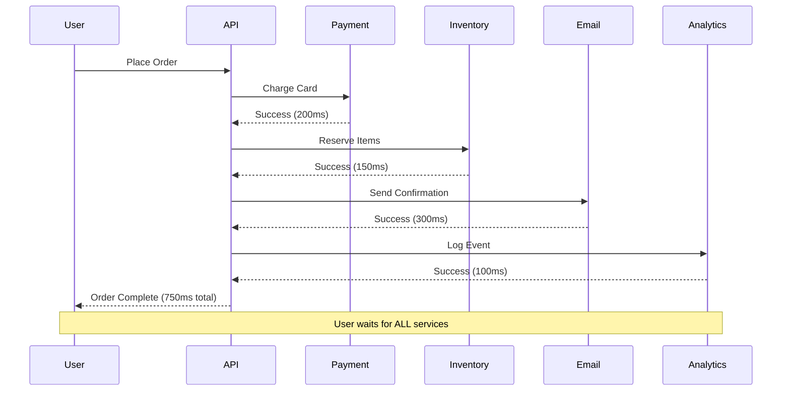

**Problems:**
- User waits 750ms (sum of all services)
- If Email service is slow/down, order fails
- Tight coupling between services
- No retry mechanism
- Can't handle traffic spikes

### The Solution: Asynchronous Messaging

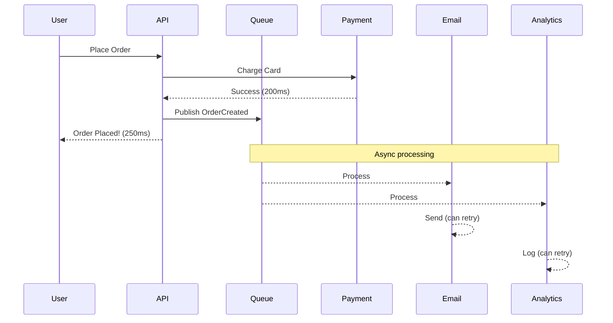

**Benefits:**
- User response: 250ms (only critical path)
- Email/Analytics failures don't affect user
- Services are decoupled
- Built-in retry and failure handling
- Queue absorbs traffic spikes

### When to Use Messaging

| Use Case | Sync or Async? | Why |
|----------|----------------|-----|
| User authentication | Sync | User needs immediate response |
| Payment processing | Sync | Critical, needs confirmation |
| Send email | Async | User doesn't need to wait |
| Generate report | Async | Long-running, do in background |
| Update search index | Async | Eventually consistent is fine |
| Real-time chat | Async (push) | Fire and forget to recipient |
| Log analytics | Async | Non-critical, can batch |

---

## 2. Message Queues (Point-to-Point)

### What is a Message Queue?

A queue holds messages until consumers process them. Each message is delivered to **one** consumer.

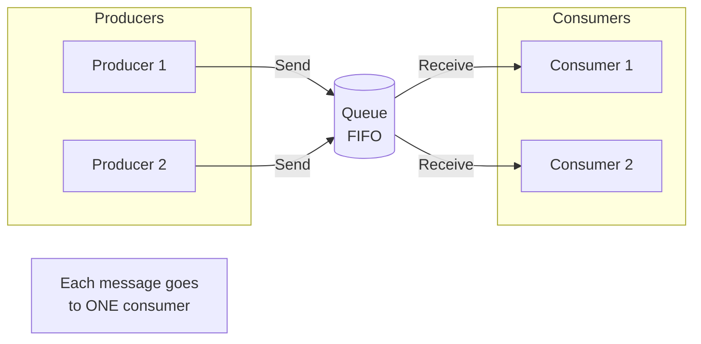

### Basic Queue Operations

```go
// Producer
func sendOrder(queue *Queue, order Order) error {
    msg := Message{
        ID:   uuid.New().String(),
        Body: serialize(order),
        Metadata: map[string]string{
            "type":      "order.created",
            "timestamp": time.Now().Format(time.RFC3339),
        },
    }
    return queue.Send(ctx, msg)
}

// Consumer
func processOrders(queue *Queue) {
    for {
        msg, err := queue.Receive(ctx) // Blocks until message available
        if err != nil {
            log.Error(err)
            continue
        }
        
        order := deserialize(msg.Body)
        if err := processOrder(order); err != nil {
            queue.Nack(ctx, msg) // Return to queue for retry
            continue
        }
        
        queue.Ack(ctx, msg) // Remove from queue
    }
}
```

### Queue Patterns

#### Work Queue (Competing Consumers)

Multiple consumers share the workload. Each message processed by exactly one consumer.

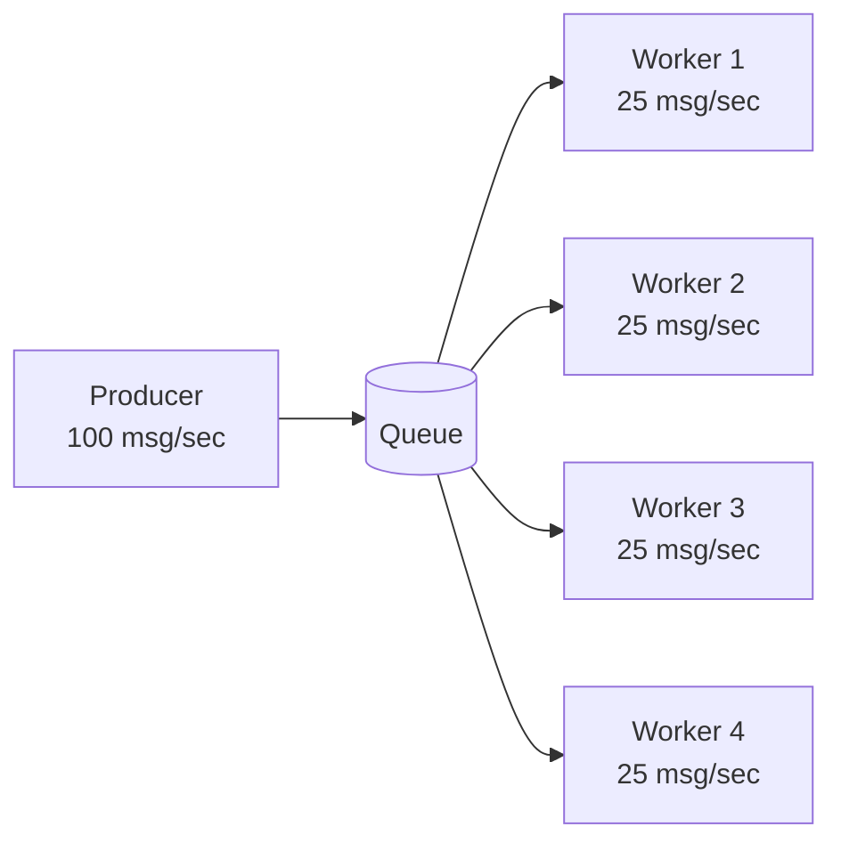

**Use case:** Distribute CPU-intensive tasks across workers

```go
// Scale workers based on queue depth
func autoScale(queue *Queue, workerPool *Pool) {
    depth := queue.Depth()
    
    if depth > 10000 && workerPool.Size() < maxWorkers {
        workerPool.Add(1)
    } else if depth < 100 && workerPool.Size() > minWorkers {
        workerPool.Remove(1)
    }
}
```

#### Request-Reply

Send request, wait for response on reply queue.

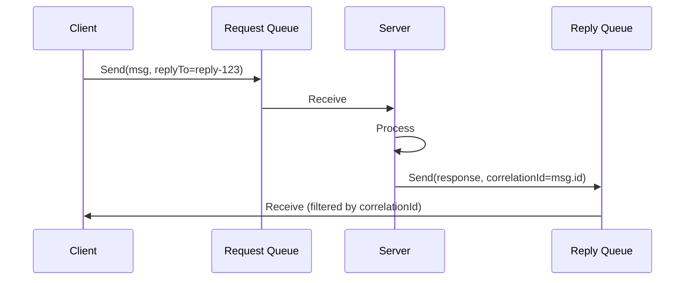

```go
func requestReply(requestQ, replyQ *Queue, request Request) (*Response, error) {
    correlationID := uuid.New().String()
    
    // Send request
    msg := Message{
        ID:            uuid.New().String(),
        CorrelationID: correlationID,
        ReplyTo:       replyQ.Name,
        Body:          serialize(request),
    }
    requestQ.Send(ctx, msg)
    
    // Wait for reply (with timeout)
    ctx, cancel := context.WithTimeout(ctx, 30*time.Second)
    defer cancel()
    
    for {
        reply, err := replyQ.Receive(ctx)
        if err != nil {
            return nil, err
        }
        if reply.CorrelationID == correlationID {
            return deserialize(reply.Body), nil
        }
        replyQ.Nack(ctx, reply) // Not ours, put back
    }
}
```

### Queue Technologies

| Technology | Type | Best For | Throughput |
|------------|------|----------|------------|
| RabbitMQ | Traditional broker | Complex routing, reliability | 10K-50K msg/sec |
| Amazon SQS | Managed service | Simple queuing, AWS integration | 3K msg/sec (standard) |
| Redis Lists | In-memory | Simple, fast, ephemeral | 100K+ msg/sec |
| ZeroMQ | Brokerless | Low latency, embedded | 1M+ msg/sec |

---

## 3. Pub/Sub (Publish-Subscribe)

### What is Pub/Sub?

Publishers send messages to topics. Subscribers receive **all** messages from topics they subscribe to.

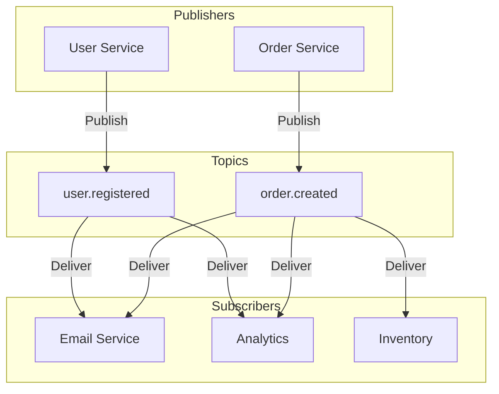

**Key difference from queues:** Each subscriber gets a **copy** of every message.

### Pub/Sub Patterns

#### Fan-Out

One message delivered to many subscribers.

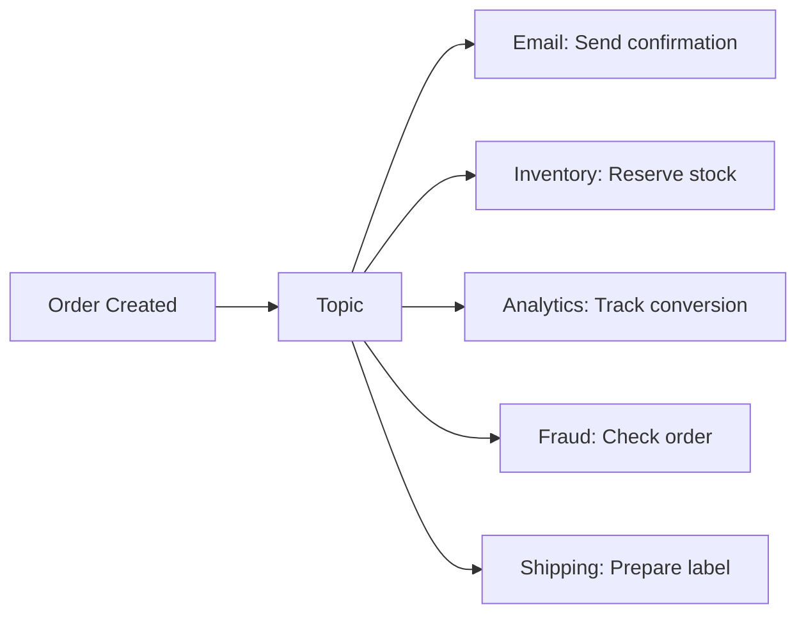

```go
// Publisher (Order Service)
func createOrder(order Order) error {
    // Save to database
    if err := db.SaveOrder(order); err != nil {
        return err
    }
    
    // Publish event - all subscribers notified
    event := Event{
        Type:      "order.created",
        Timestamp: time.Now(),
        Data:      order,
    }
    return pubsub.Publish(ctx, "orders", event)
}

// Subscriber (Email Service)
func subscribeToOrders(pubsub *PubSub) {
    sub := pubsub.Subscribe(ctx, "orders")
    
    for msg := range sub.Channel() {
        var event Event
        json.Unmarshal(msg.Payload, &event)
        
        if event.Type == "order.created" {
            sendOrderConfirmation(event.Data)
        }
    }
}
```

#### Fan-In

Many publishers, aggregated by subscriber.

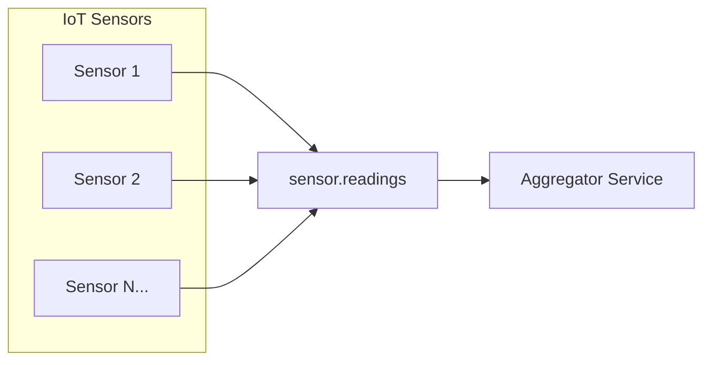

### Consumer Groups

Multiple instances share the load while ensuring each message is processed once per group.

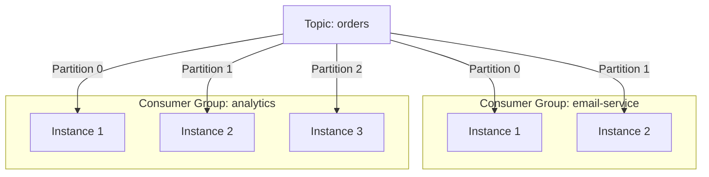

**Each consumer group** gets all messages, but within a group, messages are distributed.

### Pub/Sub Technologies

| Technology | Type | Best For | Throughput |
|------------|------|----------|------------|
| Apache Kafka | Distributed log | High throughput, replay | 1M+ msg/sec |
| Amazon SNS | Managed | AWS integration, simple fan-out | 30M+ msg/sec |
| Google Pub/Sub | Managed | GCP integration, global | 1M+ msg/sec |
| Redis Pub/Sub | In-memory | Real-time, ephemeral | 1M+ msg/sec |
| NATS | Lightweight | Microservices, low latency | 10M+ msg/sec |

---

## 4. Delivery Guarantees

### The Three Guarantees

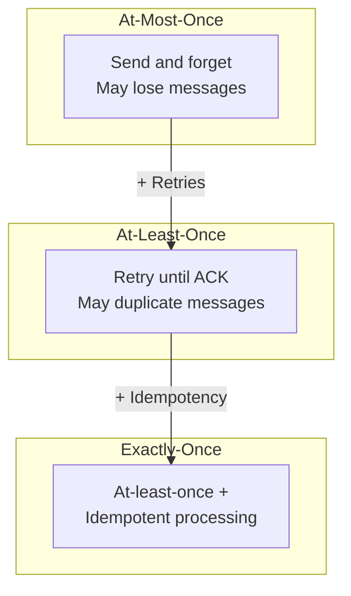

### At-Most-Once

**Definition:** Message delivered zero or one time. May be lost.

```go
// At-most-once: Fire and forget
func sendMetric(topic string, metric Metric) {
    msg := serialize(metric)
    pubsub.Publish(ctx, topic, msg) // Don't check error, don't retry
}
```

**Use when:**
- Metrics/telemetry (missing one data point is OK)
- Real-time gaming (stale data is worse than missing data)
- Logging (best effort is fine)

**Trade-off:** Fast, simple, but data loss possible

### At-Least-Once

**Definition:** Message delivered one or more times. Never lost, but may duplicate.

```go
// At-least-once: Retry until success
func sendOrder(queue *Queue, order Order) error {
    msg := Message{ID: uuid.New().String(), Body: serialize(order)}
    
    for retries := 0; retries < maxRetries; retries++ {
        err := queue.Send(ctx, msg)
        if err == nil {
            return nil
        }
        time.Sleep(backoff(retries))
    }
    return errors.New("failed to send after retries")
}

// Consumer must handle duplicates!
func processOrder(msg Message) error {
    order := deserialize(msg.Body)
    
    // Check if already processed
    if processed, _ := cache.Get(ctx, "processed:"+msg.ID); processed != "" {
        log.Info("Duplicate message, skipping", "id", msg.ID)
        return nil // Already processed
    }
    
    // Process order...
    if err := doProcess(order); err != nil {
        return err // Will be retried
    }
    
    // Mark as processed
    cache.Set(ctx, "processed:"+msg.ID, "true", 24*time.Hour)
    return nil
}
```

**Use when:**
- Order processing
- Payment handling
- Any business-critical operation

**Trade-off:** Reliable, but requires idempotent consumers

### Exactly-Once

**Definition:** Message delivered and processed exactly one time.

**The truth:** True exactly-once is impossible in distributed systems. What we actually implement is "effectively exactly-once" = at-least-once delivery + idempotent processing.

```go
// Exactly-once semantics via idempotency
func processPayment(msg Message) error {
    payment := deserialize(msg.Body)
    
    // Idempotency key prevents duplicate processing
    idempotencyKey := payment.IdempotencyKey
    
    // Use database transaction for atomicity
    tx, _ := db.Begin()
    defer tx.Rollback()
    
    // Check if already processed (within transaction)
    var exists bool
    tx.QueryRow("SELECT EXISTS(SELECT 1 FROM processed_payments WHERE key = $1)", 
        idempotencyKey).Scan(&exists)
    
    if exists {
        return nil // Already processed
    }
    
    // Process payment
    if err := chargeCard(payment); err != nil {
        return err
    }
    
    // Mark as processed (atomically with the operation)
    tx.Exec("INSERT INTO processed_payments (key, processed_at) VALUES ($1, $2)",
        idempotencyKey, time.Now())
    
    return tx.Commit()
}
```

**Techniques for exactly-once:**

| Technique | Description | Trade-off |
|-----------|-------------|-----------|
| Idempotency keys | Client provides unique key | Client must generate keys |
| Deduplication window | Broker tracks recent message IDs | Limited time window |
| Transactional outbox | Atomically write to DB + outbox | More complex |
| Event sourcing | Derive state from event log | Different architecture |

### Delivery Guarantee Comparison

| Guarantee | Message Loss | Duplicates | Complexity | Use Case |
|-----------|--------------|------------|------------|----------|
| At-most-once | Possible | No | Low | Metrics, logs |
| At-least-once | No | Possible | Medium | Most business logic |
| Exactly-once | No | No | High | Financial transactions |

---

## 5. Message Ordering

### The Ordering Problem

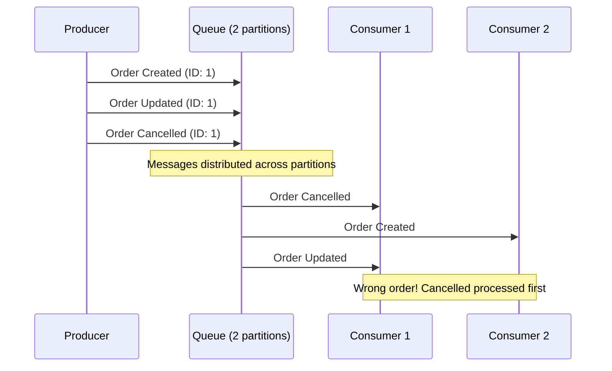

### Ordering Guarantees by System

| System | Ordering Guarantee |
|--------|-------------------|
| SQS Standard | No ordering |
| SQS FIFO | Per message group |
| Kafka | Per partition |
| RabbitMQ | Per queue |
| Kinesis | Per shard |

### Partition-Based Ordering

Messages with the same partition key go to the same partition → same consumer → ordered.

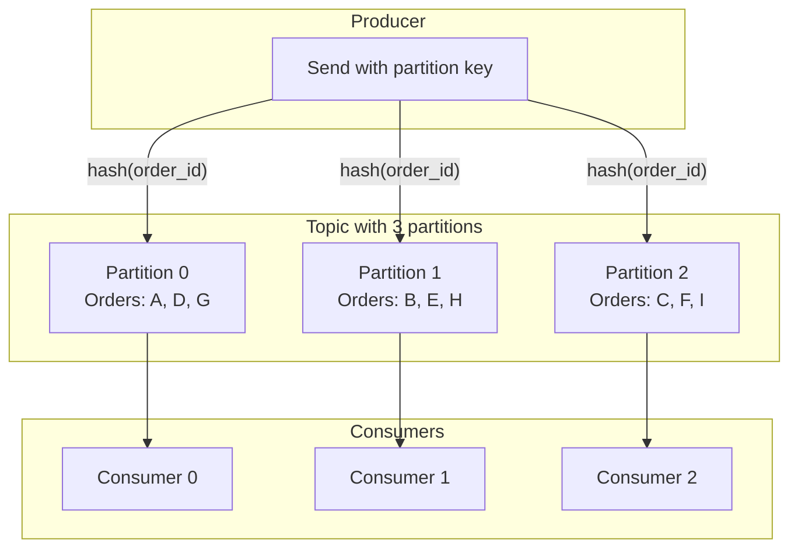

```go
// Use order ID as partition key
func publishOrderEvent(producer *Producer, event OrderEvent) error {
    return producer.Send(ctx, Message{
        Topic:        "orders",
        PartitionKey: event.OrderID, // Same order → same partition → ordered
        Body:         serialize(event),
    })
}
```

**Result:** All events for Order #123 go to same partition, processed in order.

### Handling Out-of-Order Messages

When ordering can't be guaranteed, design for it:

```go
type OrderEvent struct {
    OrderID   string
    Version   int       // Monotonically increasing
    Timestamp time.Time // For tie-breaking
    Type      string
    Data      interface{}
}

func processOrderEvent(event OrderEvent) error {
    // Get current version from database
    currentVersion, _ := db.GetOrderVersion(event.OrderID)
    
    if event.Version <= currentVersion {
        // Old event, skip (idempotent)
        log.Info("Skipping old event", "version", event.Version, "current", currentVersion)
        return nil
    }
    
    if event.Version > currentVersion+1 {
        // Gap detected, may need to wait or fetch missing events
        log.Warn("Gap in event versions", "expected", currentVersion+1, "got", event.Version)
        return ErrEventGap
    }
    
    // Process in order
    return applyEvent(event)
}
```

---

## 6. Event Sourcing

### What is Event Sourcing?

Instead of storing current state, store the sequence of events that led to current state.

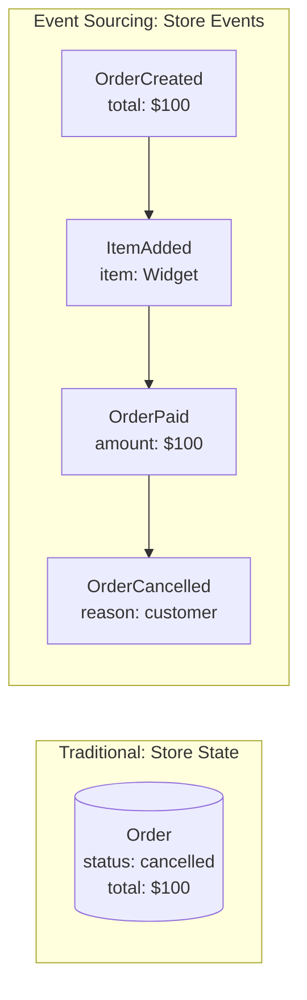

### Event Store Pattern

```go
// Events are immutable facts
type Event struct {
    ID            string
    AggregateID   string    // e.g., order_123
    AggregateType string    // e.g., "Order"
    Type          string    // e.g., "OrderCreated"
    Version       int       // Sequence number
    Timestamp     time.Time
    Data          interface{}
}

// Event store interface
type EventStore interface {
    Append(aggregateID string, events []Event, expectedVersion int) error
    Load(aggregateID string) ([]Event, error)
    LoadFrom(aggregateID string, fromVersion int) ([]Event, error)
}

// Rebuild state from events
func loadOrder(store EventStore, orderID string) (*Order, error) {
    events, err := store.Load(orderID)
    if err != nil {
        return nil, err
    }
    
    order := &Order{}
    for _, event := range events {
        order.Apply(event) // Replay each event
    }
    return order, nil
}

// Apply events to rebuild state
func (o *Order) Apply(event Event) {
    switch event.Type {
    case "OrderCreated":
        data := event.Data.(OrderCreatedData)
        o.ID = data.OrderID
        o.CustomerID = data.CustomerID
        o.Status = "pending"
        
    case "ItemAdded":
        data := event.Data.(ItemAddedData)
        o.Items = append(o.Items, data.Item)
        o.Total += data.Item.Price
        
    case "OrderPaid":
        o.Status = "paid"
        
    case "OrderCancelled":
        o.Status = "cancelled"
    }
    o.Version = event.Version
}
```

### CQRS (Command Query Responsibility Segregation)

Separate write model (events) from read model (projections).

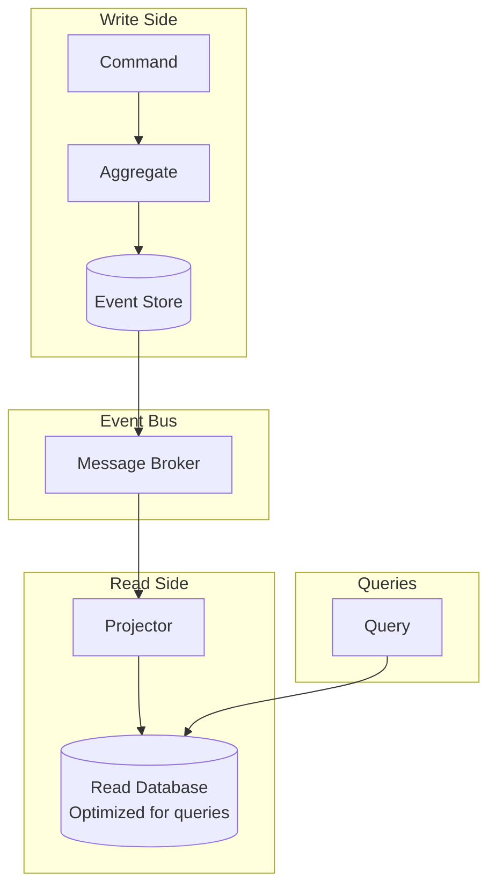

```go
// Write side: Handle command, emit events
func (h *OrderHandler) CreateOrder(cmd CreateOrderCommand) error {
    order := NewOrder()
    events := order.Create(cmd.CustomerID, cmd.Items)
    
    return h.eventStore.Append(order.ID, events, 0)
}

// Read side: Project events to read model
func (p *OrderProjector) Handle(event Event) error {
    switch event.Type {
    case "OrderCreated":
        return p.db.Exec(`
            INSERT INTO orders_view (id, customer_id, status, created_at)
            VALUES ($1, $2, 'pending', $3)
        `, event.AggregateID, event.Data.CustomerID, event.Timestamp)
        
    case "OrderPaid":
        return p.db.Exec(`
            UPDATE orders_view SET status = 'paid', paid_at = $2 
            WHERE id = $1
        `, event.AggregateID, event.Timestamp)
    }
    return nil
}
```

### Event Sourcing Benefits & Drawbacks

| Benefits | Drawbacks |
|----------|-----------|
| Complete audit trail | More complex |
| Can rebuild any past state | Event schema evolution is hard |
| Easy temporal queries | Eventually consistent reads |
| Natural fit for event-driven | Storage grows forever |
| Debug by replaying events | Learning curve |

---

## 7. Dead Letter Queues

### What is a DLQ?

A queue for messages that can't be processed after multiple retries.

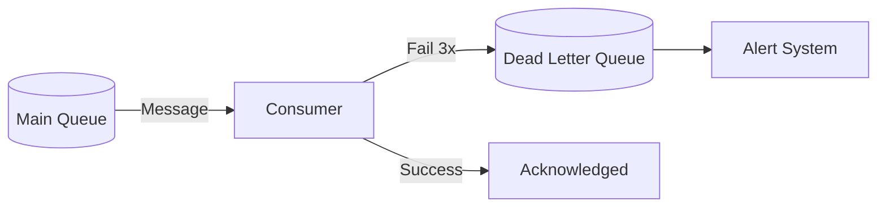

### DLQ Implementation

```go
type Message struct {
    ID          string
    Body        []byte
    RetryCount  int
    MaxRetries  int
    Errors      []string
}

func processWithDLQ(mainQ, dlq *Queue) {
    for {
        msg, _ := mainQ.Receive(ctx)
        
        err := process(msg)
        if err == nil {
            mainQ.Ack(ctx, msg)
            continue
        }
        
        msg.RetryCount++
        msg.Errors = append(msg.Errors, err.Error())
        
        if msg.RetryCount >= msg.MaxRetries {
            // Send to DLQ
            dlq.Send(ctx, msg)
            mainQ.Ack(ctx, msg) // Remove from main queue
            
            alertOps(msg) // Notify operations team
        } else {
            // Retry with backoff
            mainQ.Nack(ctx, msg, backoff(msg.RetryCount))
        }
    }
}
```

### DLQ Best Practices

| Practice | Description |
|----------|-------------|
| Preserve context | Include original message, all error messages, timestamps |
| Set up alerts | Notify when DLQ depth increases |
| Retention policy | How long to keep failed messages |
| Replay mechanism | Tool to retry DLQ messages after fixing bugs |
| Separate DLQs | Different DLQs for different failure types |

---

## 8. Backpressure

### What is Backpressure?

When consumers can't keep up with producers, what happens?

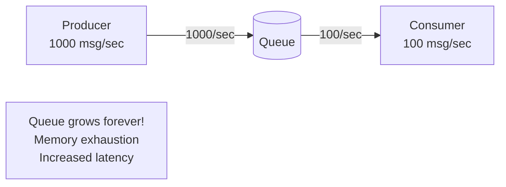

### Backpressure Strategies

#### 1. Drop Messages

```go
func (q *BoundedQueue) Send(msg Message) error {
    select {
    case q.channel <- msg:
        return nil
    default:
        metrics.Increment("messages.dropped")
        return ErrQueueFull // Caller decides what to do
    }
}
```

**Use when:** Data is time-sensitive, old data is useless (real-time metrics)

#### 2. Block Producer

```go
func (q *BlockingQueue) Send(ctx context.Context, msg Message) error {
    select {
    case q.channel <- msg:
        return nil
    case <-ctx.Done():
        return ctx.Err() // Timeout or cancellation
    }
}
```

**Use when:** Every message matters, can tolerate producer slowdown

#### 3. Buffer and Batch

```go
type BatchBuffer struct {
    buffer    []Message
    maxSize   int
    flushTime time.Duration
}

func (b *BatchBuffer) Add(msg Message) {
    b.mu.Lock()
    b.buffer = append(b.buffer, msg)
    
    if len(b.buffer) >= b.maxSize {
        b.flush()
    }
    b.mu.Unlock()
}

func (b *BatchBuffer) flushPeriodically() {
    ticker := time.NewTicker(b.flushTime)
    for range ticker.C {
        b.mu.Lock()
        if len(b.buffer) > 0 {
            b.flush()
        }
        b.mu.Unlock()
    }
}
```

**Use when:** Can batch process, reduces per-message overhead

#### 4. Scale Consumers

```go
func autoScaleConsumers(queue *Queue, pool *WorkerPool) {
    ticker := time.NewTicker(10 * time.Second)
    
    for range ticker.C {
        depth := queue.Depth()
        rate := queue.ProcessingRate()
        
        // Time to drain queue at current rate
        drainTime := time.Duration(depth/rate) * time.Second
        
        if drainTime > 5*time.Minute && pool.Size() < maxWorkers {
            pool.Scale(pool.Size() + 1)
        } else if drainTime < 30*time.Second && pool.Size() > minWorkers {
            pool.Scale(pool.Size() - 1)
        }
    }
}
```

**Use when:** Can add resources, messages must all be processed

---

## 9. Real-World Architectures

### Apache Kafka Architecture

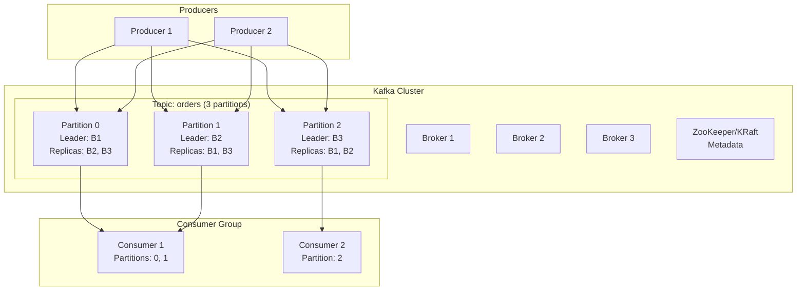

**Kafka characteristics:**
- Distributed commit log
- High throughput (millions msg/sec)
- Configurable retention (replay old messages)
- Consumer groups for parallel processing
- Strong ordering per partition

### RabbitMQ Architecture

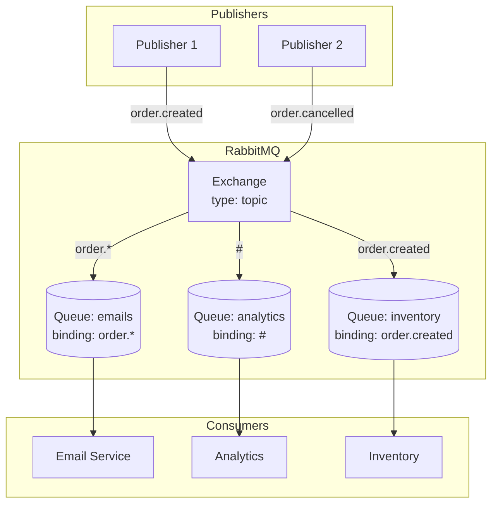

**RabbitMQ characteristics:**
- Traditional message broker
- Flexible routing (exchanges, bindings)
- Message acknowledgments
- Lower throughput than Kafka but simpler
- Messages deleted after consumption

### Comparison

| Feature | Kafka | RabbitMQ | SQS |
|---------|-------|----------|-----|
| Model | Log-based | Queue-based | Queue-based |
| Throughput | Very high | Medium | Low-Medium |
| Ordering | Per partition | Per queue | FIFO queues only |
| Replay | Yes (retention) | No | No |
| Routing | Consumer-side | Broker-side | None |
| Operations | Complex | Medium | Managed |
| Best for | Event streaming, high volume | Task queues, RPC | Simple queuing, AWS |

---

## 10. Quick Reference

### Message Design Checklist

```
□ Include idempotency key / message ID
□ Include timestamp
□ Include version for ordering
□ Include correlation ID for tracing
□ Schema versioning strategy
□ Appropriate serialization (JSON, Protobuf, Avro)
□ Size limits considered
```

### Choosing a Messaging Pattern

```
Need to distribute work?           → Work Queue
Need multiple services notified?   → Pub/Sub (Fan-out)
Need request/response?             → Request-Reply or RPC
Need event history / replay?       → Event Sourcing + Kafka
Need simple AWS integration?       → SQS + SNS
```

### Numbers to Remember

| Metric | Value |
|--------|-------|
| Kafka throughput (per broker) | 100K-200K msg/sec |
| RabbitMQ throughput | 20K-50K msg/sec |
| SQS throughput (standard) | 3K msg/sec |
| SQS FIFO throughput | 300 msg/sec |
| Typical message size | 1KB - 1MB |
| Kafka max message | 1MB (configurable) |
| SQS max message | 256KB |

---

## Summary

1. **Queues vs Pub/Sub:** Queues for work distribution (one consumer), Pub/Sub for broadcasting (all subscribers)

2. **Delivery guarantees:** At-most-once (fast, lossy), at-least-once (reliable, duplicates), exactly-once (at-least-once + idempotency)

3. **Ordering:** Use partition keys for ordering related messages. Design for out-of-order when you can't guarantee.

4. **Event sourcing:** Store events, not state. Enables replay, audit, temporal queries.

5. **Backpressure:** Handle it explicitly—drop, block, buffer, or scale.

**The golden rule:** Design consumers to be idempotent. Assume messages will be delivered multiple times.

**Next module:** [Storage](../../storage/concepts/concepts.md) - Block, object, and file storage at scale.