# Module 2: Scaling

> "Scaling isn't about handling more load. It's about handling more load without redesigning your system."

This module covers the fundamental approaches to growing system capacity: vertical scaling, horizontal scaling, stateless architecture, and load balancing.

---

## 1. Vertical vs Horizontal Scaling

### What's the Difference?

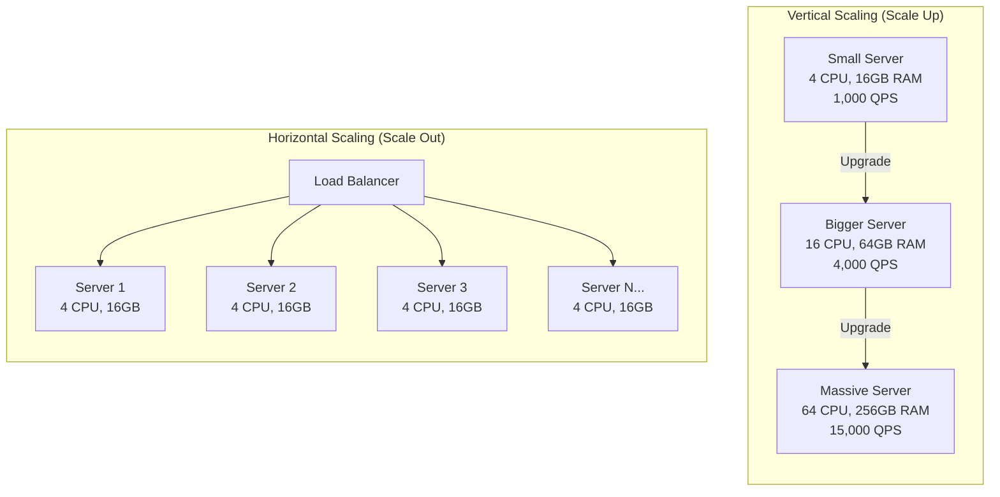

### Vertical Scaling (Scale Up)

**What**: Add more power to existing machine (CPU, RAM, disk, network).

**Real-world example**: Upgrading from AWS `m5.large` (2 vCPU, 8GB) to `m5.4xlarge` (16 vCPU, 64GB).

| Instance | vCPU | RAM | Network | Price/month |
|----------|------|-----|---------|-------------|
| m5.large | 2 | 8 GB | Up to 10 Gbps | ~$70 |
| m5.xlarge | 4 | 16 GB | Up to 10 Gbps | ~$140 |
| m5.4xlarge | 16 | 64 GB | Up to 10 Gbps | ~$560 |
| m5.24xlarge | 96 | 384 GB | 25 Gbps | ~$3,360 |

**When to use**:
- Database servers (scaling DBs horizontally is complex)
- Legacy applications that can't be distributed
- When you haven't hit hardware limits yet
- Quick fix while building horizontal solution

**The ceiling**:
```
Biggest AWS instance (2024): u-24tb1.metal
- 448 vCPUs
- 24 TB RAM
- ~$200,000/month

That's it. That's the ceiling.
```

### Horizontal Scaling (Scale Out)

**What**: Add more machines of similar size.

**Real-world example**: Going from 5 web servers to 50 web servers behind a load balancer.

**When to use**:
- Web/application servers (stateless workloads)
- When you need "infinite" scaling
- When you need high availability (no single point of failure)
- Cost optimization at scale

**The challenge**: Your application must support it (stateless design, distributed data).

### Trade-off Table

| Factor | Vertical | Horizontal |
|--------|----------|------------|
| **Complexity** | Simple (just upgrade) | Complex (distributed systems) |
| **Ceiling** | Hardware limits (~500 CPU, 24TB RAM) | Virtually unlimited |
| **Downtime** | Usually required | Zero downtime possible |
| **Cost curve** | Exponential (big servers cost more per unit) | Linear (add more small servers) |
| **Failure impact** | Total outage | Partial degradation |
| **Data consistency** | Easy (single machine) | Hard (distributed state) |
| **Network overhead** | None | Inter-node communication |
| **Best for** | Databases, legacy apps | Stateless services, web tier |

### The Cost Curve Reality

```
Cost ($)
    │                              ╱ Vertical (exponential)
    │                           ╱
    │                        ╱
    │                     ╱
    │                  ╱
    │              ╱
    │          ╱  ─────────────── Horizontal (linear)
    │       ╱─────
    │   ╱───
    │╱──
    └─────────────────────────────────────
                              Capacity
```

**Real numbers**: 
- 1× m5.24xlarge (96 vCPU): $3,360/month
- 24× m5.large (48 vCPU total): $1,680/month

Half the cost, half the CPU—but with horizontal you can add more. With vertical, you've hit the wall.

---

## 2. Stateless Design

### Why Statelessness Matters

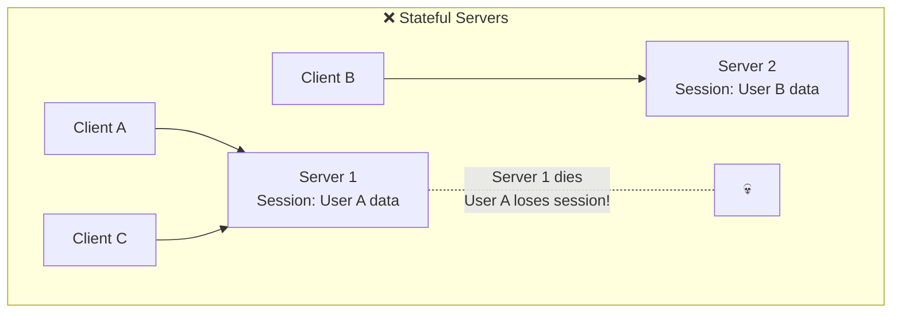

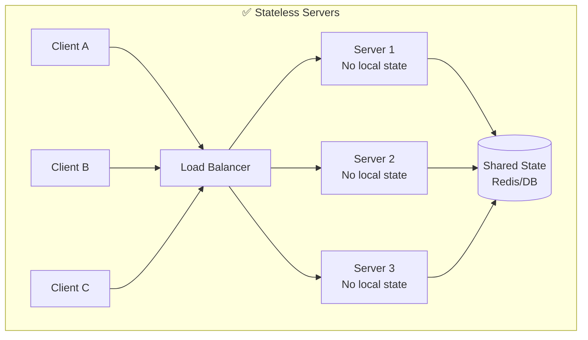

### What is Stateless?

A server is **stateless** if any request can be handled by any server instance. The server doesn't remember anything about previous requests.

**Stateful** (bad for scaling):
```python
# Server stores user session in memory
sessions = {}

def login(user_id):
    sessions[user_id] = {"cart": [], "logged_in_at": now()}
    
def add_to_cart(user_id, item):
    sessions[user_id]["cart"].append(item)  # Only works on THIS server!
```

**Stateless** (good for scaling):
```python
# Server stores nothing - all state in external store
def login(user_id):
    redis.set(f"session:{user_id}", {"cart": [], "logged_in_at": now()})
    
def add_to_cart(user_id, item):
    session = redis.get(f"session:{user_id}")
    session["cart"].append(item)
    redis.set(f"session:{user_id}", session)  # Works from ANY server
```

### Where to Put the State

| State Type | Where to Store | Example |
|------------|----------------|---------|
| User sessions | Redis, Memcached | Login state, shopping cart |
| User data | Database | Profile, preferences |
| Uploaded files | Object storage (S3) | Images, documents |
| Cache | Redis, Memcached | Computed results, API responses |
| Configuration | Config service, environment | Feature flags, secrets |

### Stateless Architecture Pattern

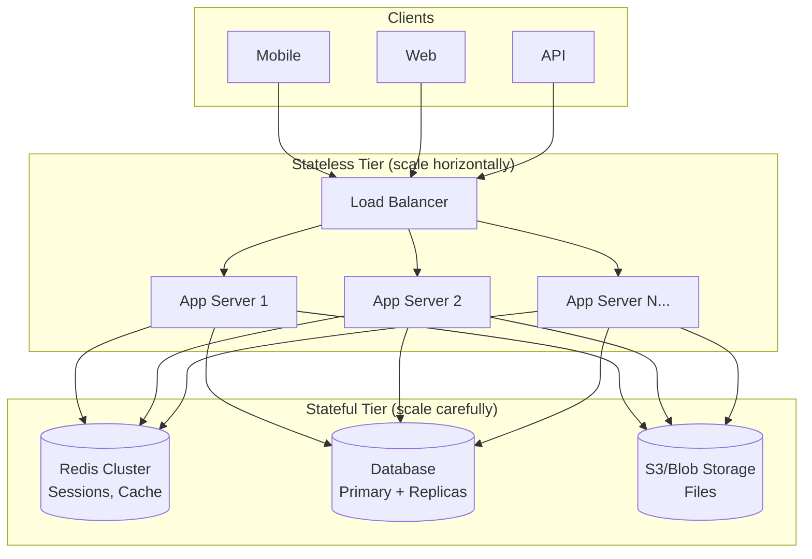

### The Twelve-Factor App: Statelessness

From the [Twelve-Factor methodology](https://12factor.net/processes):

> "Twelve-factor processes are stateless and share-nothing. Any data that needs to persist must be stored in a stateful backing service, typically a database."

**Key principles**:
1. **No sticky sessions**: Don't rely on load balancer affinity
2. **No local disk for state**: Use external storage
3. **No in-memory state**: Use Redis/Memcached
4. **Environment parity**: Any server can handle any request

### What About Sticky Sessions?

**Sticky sessions** (session affinity): Load balancer routes user to same server.

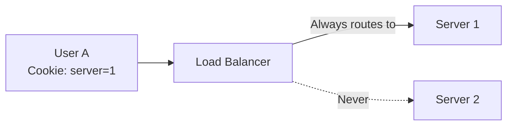

**Why it's a crutch, not a solution**:

| Problem | Impact |
|---------|--------|
| Server dies | User loses session, must re-login |
| Uneven load | Popular users cluster on one server |
| Can't scale down | Must drain sessions before removing server |
| Deployment complexity | Rolling deploys become session-aware |

**When sticky sessions are okay**: 
- Temporary migration from stateful to stateless
- WebSocket connections (inherently stateful)
- Never as a permanent architecture

---

## 3. Load Balancing

### What is a Load Balancer?

A load balancer distributes incoming requests across multiple servers.

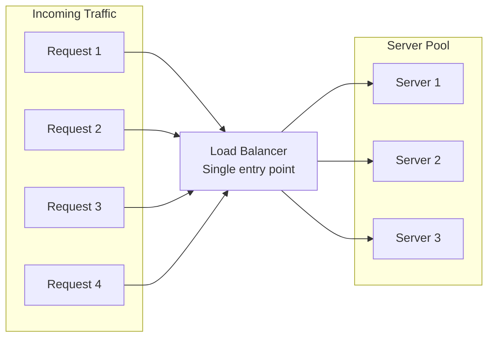

### Load Balancing Algorithms

#### Round Robin

Requests distributed sequentially: 1→2→3→1→2→3...

```
Request 1 → Server 1
Request 2 → Server 2
Request 3 → Server 3
Request 4 → Server 1
Request 5 → Server 2
...
```

**Pros**: Simple, even distribution
**Cons**: Ignores server capacity, ignores current load
**Use when**: Servers are identical, requests are similar cost

#### Weighted Round Robin

Servers get traffic proportional to weight.

```
Server 1 (weight: 3) → Gets 3 requests
Server 2 (weight: 1) → Gets 1 request
Server 3 (weight: 1) → Gets 1 request
```

**Use when**: Servers have different capacities (e.g., mixing instance sizes)

#### Least Connections

Route to server with fewest active connections.

```
Server 1: 45 connections  
Server 2: 23 connections ← Next request goes here
Server 3: 67 connections
```

**Pros**: Adapts to varying request durations
**Cons**: Doesn't account for server capacity
**Use when**: Requests have varying processing times

#### Weighted Least Connections

Combines weights with connection count.

```
Score = Active Connections / Weight

Server 1: 45 conn, weight 3 → Score: 15
Server 2: 23 conn, weight 1 → Score: 23
Server 3: 30 conn, weight 2 → Score: 15

Next request → Server 1 or Server 3 (tie)
```

#### IP Hash

Hash client IP to determine server. Same client always hits same server.

```python
server_index = hash(client_ip) % num_servers
```

**Pros**: Session affinity without cookies
**Cons**: Uneven distribution possible, problematic when servers change
**Use when**: You need weak session affinity

#### Least Response Time

Route to server with fastest recent response time.

**Pros**: Optimizes for user experience
**Cons**: Requires health monitoring, can oscillate
**Use when**: Response time is critical, servers have varying performance

### Algorithm Comparison

| Algorithm | Best For | Avoid When |
|-----------|----------|------------|
| Round Robin | Homogeneous servers, similar requests | Mixed server sizes, varying request costs |
| Weighted Round Robin | Mixed server capacities | Request costs vary widely |
| Least Connections | Long-lived connections, varying request times | Need session affinity |
| IP Hash | Weak session affinity needed | Server count changes frequently |
| Least Response Time | Latency-sensitive applications | Servers have similar performance |

### Layer 4 vs Layer 7 Load Balancing

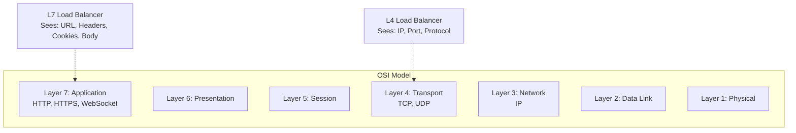

#### Layer 4 (Transport Layer)

Operates on TCP/UDP level. Sees: IP addresses, ports, protocol.

```
Client 192.168.1.1:54321 → LB → Server 10.0.0.5:8080
```

**Capabilities**:
- Fast (no payload inspection)
- Protocol agnostic
- NAT-based routing

**Cannot do**:
- Route based on URL path
- Route based on HTTP headers
- SSL termination (without terminating TCP)
- Content-based routing

#### Layer 7 (Application Layer)

Operates on HTTP/HTTPS level. Sees: URLs, headers, cookies, body.

```
GET /api/users HTTP/1.1
Host: example.com
Cookie: session=abc123

→ LB inspects all of this → Routes to appropriate server
```

**Capabilities**:
- Route by URL: `/api/*` → API servers, `/static/*` → CDN
- Route by header: `Accept-Language: fr` → French servers
- Route by cookie: A/B testing, canary deployments
- SSL termination
- Request modification (add headers, rewrite URLs)
- Caching
- Compression
- WAF (Web Application Firewall)

**Trade-off**:
- More features
- Higher latency (~1-2ms added)
- Higher resource usage
- More complex configuration

### L4 vs L7 Comparison

| Feature | Layer 4 | Layer 7 |
|---------|---------|---------|
| Speed | Faster (~μs overhead) | Slower (~ms overhead) |
| SSL termination | No (pass-through) | Yes |
| Content routing | No | Yes (URL, headers, cookies) |
| Protocol support | Any TCP/UDP | HTTP/HTTPS/WebSocket |
| Health checks | TCP connect | HTTP status codes, content |
| Caching | No | Yes |
| Cost | Lower | Higher |
| Use case | High-throughput, simple routing | Complex routing, web apps |

### Real-World Load Balancers

| Product | Type | Use Case |
|---------|------|----------|
| AWS ALB | L7 | Web applications, microservices |
| AWS NLB | L4 | High throughput, non-HTTP |
| AWS CLB | L4/L7 | Legacy (don't use for new projects) |
| nginx | L4/L7 | Self-hosted, flexible |
| HAProxy | L4/L7 | Self-hosted, high performance |
| Cloudflare | L7 | CDN + LB + DDoS protection |
| Google Cloud LB | L4/L7 | GCP workloads |

### Health Checks

Load balancers must know which servers are healthy.

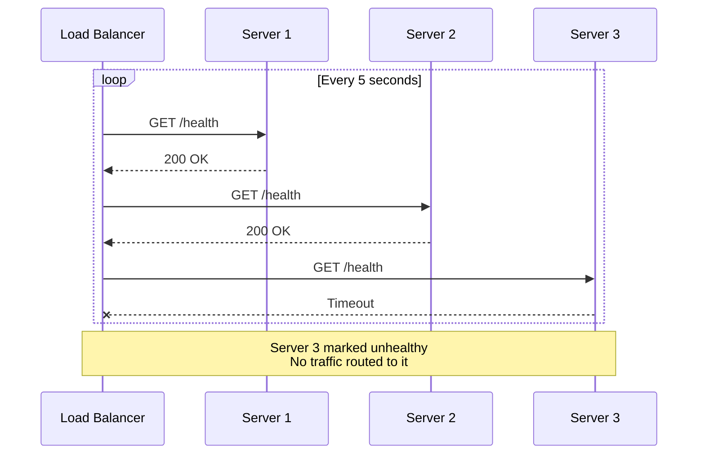

**Health check parameters**:

| Parameter | Typical Value | Purpose |
|-----------|---------------|---------|
| Interval | 5-30 seconds | How often to check |
| Timeout | 2-5 seconds | How long to wait for response |
| Unhealthy threshold | 2-3 failures | Failures before marking unhealthy |
| Healthy threshold | 2-3 successes | Successes before marking healthy |

**Health check depth**:

```
Shallow: TCP connect succeeds
         → Server is listening

Medium:  HTTP 200 on /health
         → Application is running

Deep:    HTTP 200 on /health that checks DB, cache, dependencies
         → Full system is working
         ⚠️ Risk: One slow dependency fails all health checks
```

### Load Balancer High Availability

The load balancer itself is a single point of failure. Solution: redundant load balancers.

```mermaid
flowchart TB
    subgraph "DNS"
        DNS[example.com<br/>→ Multiple IPs]
    end
    
    subgraph "Load Balancer Tier"
        LB1[LB Primary<br/>192.168.1.1]
        LB2[LB Secondary<br/>192.168.1.2]
        VIP[Virtual IP<br/>Floats between LB1/LB2]
    end
    
    subgraph "Servers"
        S1[Server 1]
        S2[Server 2]
        S3[Server 3]
    end
    
    DNS --> VIP
    VIP --> LB1
    VIP -.->|Failover| LB2
    LB1 & LB2 --> S1 & S2 & S3
```

**Techniques**:
- **Active-Passive**: Secondary takes over on primary failure
- **Active-Active**: Both handle traffic, DNS or anycast routing
- **Managed service**: AWS ALB/NLB handle this for you (multi-AZ)

---

## 4. Scaling Patterns in Practice

### Pattern 1: The Classic Web Tier

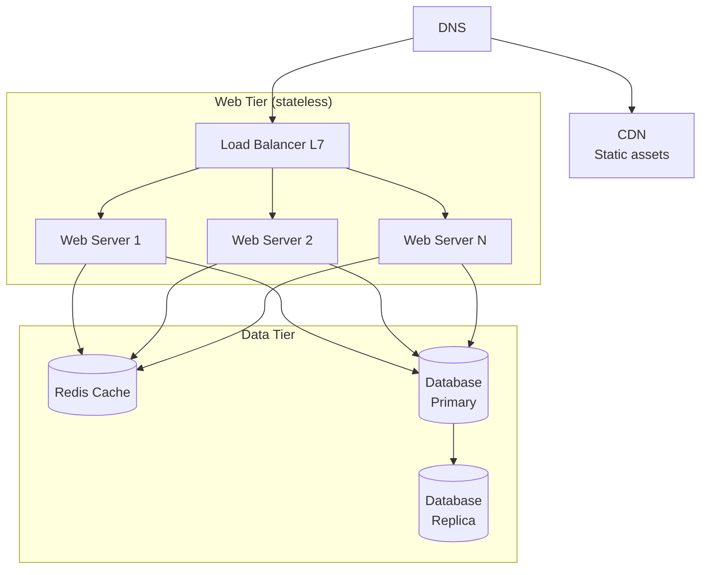

**Scaling playbook**:
1. Traffic increases → Add web servers (easy)
2. Database reads slow → Add read replicas
3. Database writes slow → Scale up primary, then shard (hard)
4. Cache hit rate low → Add cache capacity

### Pattern 2: Microservices Scaling

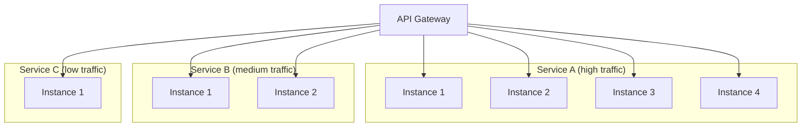

**Benefit**: Scale each service independently based on its load.

### Pattern 3: Auto-Scaling

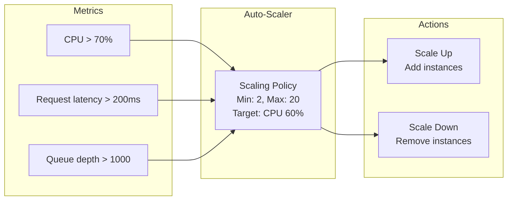

**Auto-scaling parameters**:

| Parameter | Example | Purpose |
|-----------|---------|---------|
| Min instances | 2 | Always running (availability) |
| Max instances | 20 | Cost ceiling |
| Target metric | CPU 60% | What to optimize for |
| Scale-up cooldown | 60 seconds | Prevent thrashing |
| Scale-down cooldown | 300 seconds | Prevent premature scale-down |

**Scaling metrics**:

| Metric | Good For | Watch Out For |
|--------|----------|---------------|
| CPU utilization | Compute-bound workloads | Doesn't reflect I/O-bound work |
| Request count | Web servers | Doesn't reflect request cost |
| Queue depth | Workers | Lagging indicator |
| Latency | User experience | Can cause over-scaling on slow dependencies |
| Custom metrics | Specific needs | More complex to implement |

---

## 5. Real-World Examples

### How Netflix Scales

**Challenge**: 200M+ subscribers, peak 15% of internet traffic

**Architecture**:
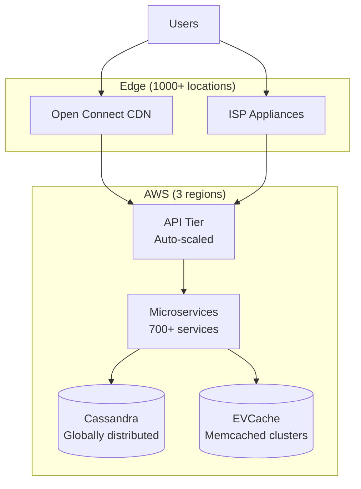

**Key decisions**:
- Stateless microservices (can scale any service independently)
- Custom CDN (Open Connect) at ISP locations
- Cassandra for global writes (no single primary bottleneck)
- EVCache: Distributed Memcached for session/personalization

### How Slack Scales

**Challenge**: Millions of concurrent WebSocket connections

**Architecture**:
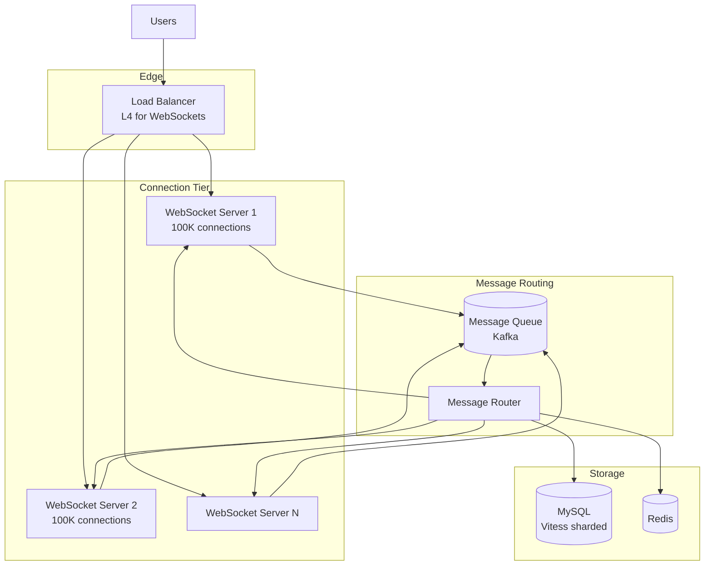

**Key decisions**:
- L4 load balancing (WebSocket is long-lived TCP)
- Each WS server handles ~100K connections
- Message fanout through Kafka (not peer-to-peer)
- Vitess for MySQL sharding

---

## 6. Common Scaling Mistakes

### ❌ Mistake 1: Scaling Before Measuring

```
Wrong: "We're slow, add more servers!"
Right: "Profiling shows DB queries take 80% of request time"
       → Scaling app servers won't help
       → Need to optimize queries or add caching
```

### ❌ Mistake 2: Premature Horizontal Scaling

```
Current: 1 server at 20% capacity
Wrong: "Let's add Kubernetes and 10 servers for future scale"
Right: Run on bigger single server until you actually need to distribute
       → Simpler operations
       → Easier debugging
       → Lower cost
```

### ❌ Mistake 3: Stateful Services Behind Load Balancer

```
Wrong: 
  Load Balancer → [Server 1 with Session A]
                → [Server 2 with Session B]
                
  Server 1 dies → Session A lost!

Right:
  Load Balancer → [Stateless Server 1] → Redis (sessions)
                → [Stateless Server 2] → Redis (sessions)
```

### ❌ Mistake 4: Ignoring the Database

```
Web tier: Easy to scale (add servers)
Database: Hard to scale

Common pattern:
- Scale web tier 10x ✓
- Database becomes bottleneck ✗
- Rewrite application for sharding (painful)

Better:
- Cache aggressively before scaling web tier
- Add read replicas early
- Plan data model for eventual sharding
```

### ❌ Mistake 5: Linear Scaling Assumptions

```
1 server: 1,000 QPS
10 servers: 10,000 QPS?

Actually: Maybe 8,000 QPS due to:
- Load balancer overhead
- Shared database contention
- Network saturation
- Coordination costs
```

---

## 7. Quick Reference

### Scaling Decision Tree

```
Is it a stateless service?
├── Yes → Add more instances behind load balancer
└── No → Can you make it stateless?
    ├── Yes → Extract state to external store, then scale
    └── No → Scale vertically (bigger machine)
        └── Hit limits? → Shard or re-architect
```

### Numbers to Remember

| Metric | Single Server (typical) | Horizontally Scaled |
|--------|-------------------------|---------------------|
| Web server QPS | 1,000-10,000 | 10,000-1,000,000+ |
| WebSocket connections | 10,000-100,000 | 1,000,000+ |
| Database writes | 1,000-10,000 QPS | Requires sharding |
| Database reads | 10,000-50,000 QPS | Add read replicas |

### Load Balancer Selection

```
Need simple TCP/UDP routing? → L4 (NLB)
Need URL-based routing?      → L7 (ALB)
Need WebSocket support?      → L4 or L7 (check limits)
Need cheapest option?        → L4
Need SSL termination?        → L7
```

---

## Summary

1. **Vertical vs Horizontal**: Scale up until you can't, then scale out. But design for horizontal from day one.

2. **Stateless design**: Any server can handle any request. State lives in external stores (Redis, DB, S3).

3. **Load balancing**: Distribute traffic across servers. L4 for performance, L7 for features.

4. **Scale what's slow**: Measure first. Usually it's the database, not the web tier.

5. **Plan for failure**: Horizontal scaling gives you redundancy. Use it.

**Next module**: [Databases](../databases/concepts/concepts.md) - The hardest thing to scale.